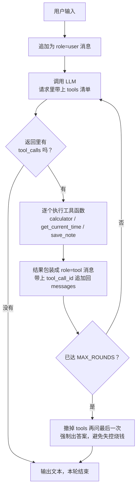

# hello-agent v1

> 我们的第一个 Agent —— 单文件、约 400 行（含注释）、零框架。
>
> 目标不是功能多，而是**你从上往下读一遍，就能看懂 Agent 到底是什么**。

---

## 一句话原理

```
Agent = LLM + 工具 + 循环 + 状态
```

LLM 本身只是一个「文本进、文本出」的函数。它不会算术、不知道今天几号、更没
办法把东西写进磁盘。所谓 Agent 框架，做的就是这么一件事：

> 给这个函数配上几只手（**工具**），然后让它在**循环**里反复调用自己，
> 一路把过程记在**状态**里，直到它说「我不需要工具了」。

整份代码的核心就是 `agent.py` 里那 40 行的 `Agent.run()`。

---

## 快速开始

本项目直接共用你机器上已有的 **`myenv`** 虚拟环境，不单独建 `.venv`。

```
myenv 是 ~/.zshrc 里定义的别名：  source .../jupyterlab/myenv/bin/activate
```

```bash
# 1. 激活虚拟环境
myenv

# 2. 配置密钥 —— 只需做一次，全项目共用这一份
cd ..
cp .env.example .env
#    打开仓库根的 .env，把 LLM_API_KEY 填上

# 3. 进入项目，确认依赖齐全
cd agent-v1
pip install -r requirements.txt     # openai / python-dotenv / rich

# 4. 先跑工具层自检 —— 这一步不需要 API Key
python agent.py --selftest

# 5. 开始对话
python agent.py
```

> 💡 也可以在 VS Code 里 `Cmd+Shift+P` → `Tasks: Run Task`，
> 用项目预置的任务（v1/v2 各自的启动与自检）。

### 配置怎么组织：分两层，各归各位

不用每个版本复制 `.env`，也不会出现「v1 得忍受 v2 的参数」：

| 层 | 文件 | 放什么 | 谁在用 |
|---|---|---|---|
| **共享层** | `<仓库根>/.env` | 密钥、接口地址、模型名 | 所有版本 |
| **版本层** | `agent-v1/.env` | v1 独有的调参 | 可选，不存在也没关系 |

判断标准只有一句话：**「换个版本，这一项会不会变？」**

- 「连哪家 API、用哪个模型」→ 换版本不会变 → 共享层
- 「v1 自己特有的参数」→ **v1 现在一个都没有**，所以这个文件根本不需要创建

加载优先级（靠前的不会被后面的覆盖）：

| 优先级 | 来源 | 用途 |
|---|---|---|
| 1（最高） | 真实环境变量 | `LLM_MODEL=xxx python agent.py` 一次性实验 |
| 2 | `agent-v1/.env` | 可选，只放这个版本想覆盖的项 |
| 3（兜底） | `<仓库根>/.env` | ⭐ 平时只动这一个 |

想知道当前到底读到了什么？直接问它：

```bash
python agent.py --config
```

会打印出「加载了哪几个文件、每一项当前是什么值、属于谁」—— 排查配置没生效时，
先看这个。

> ⚠️ 必须选一个**支持 tool calling（函数调用）**的模型，否则 Agent 跑不起来。

---

## 亲手验证一下循环真的在转

启动后依次输入下面几句，注意观察终端里 `🔧 调用 ...` 的输出：

| 你可以输入 | 预期现象 | 验证了什么 |
|---|---|---|
| `你好` | 直接回答，**不触发任何工具** | 不需要工具时，模型不该乱调 |
| `现在几点了？` | 打印 `🔧 调用 get_current_time()` | 模型的知识边界 |
| `算一下 1234 * 5678 + 90` | 打印 `🔧 调用 calculator(...)`，答案 `7006742` | 模型的能力边界 |
| `把今天的日期存成一条笔记，标题是 day1` | **连续**调用 `get_current_time` → `save_note` | 多步循环，Agent 的核心价值 |
| `/reset` 之后问 `我刚才让你存了什么？` | 答不上来 | 历史确实被清空了 |

最后可以 `cat notes/day1.md` 看看磁盘上真的多了一个文件 —— 模型改变了外部世界。

---

## 核心原理：主循环长什么样



三个关键点，都在图里：

1. **`tools` 清单是每次请求都带上的。** 模型不是「知道」有哪些工具，而是每次
   都被重新告知一遍。
2. **终止条件是「这一轮没有 tool_calls」。** 没有任何 `FINISH` 标签之类的约定，
   是否收工完全由模型自己决定。
3. **`role="tool"` 消息必须带 `tool_call_id`。** 否则模型不知道这条结果是回应
   它哪一次调用的。

### 状态：`messages` 是唯一的状态

```python
[
  {"role": "system",    "content": "你是一个可以通过调用工具来完成任务的助手……"},
  {"role": "user",      "content": "把今天的日期存成一条笔记"},          # ← 你
  {"role": "assistant", "content": None, "tool_calls": [...]},           # ← 模型要工具
  {"role": "tool",      "tool_call_id": "...", "content": "2026-09-16"}, # ← 我们替它执行
  {"role": "assistant", "content": None, "tool_calls": [...]},           # ← 模型又要工具
  {"role": "tool",      "tool_call_id": "...", "content": "已保存……"},   # ← 我们替它执行
  {"role": "assistant", "content": "已经帮你存好啦"},                     # ← 收工
]
```

**整个 Agent 的历史，就是这一条不断变长的列表。** 没有数据库，没有向量库，
就这么简单。

---

## 代码导读

`agent.py` 分五段，建议从上往下读：

| 段落 | 内容 | 学习重点 |
|---|---|---|
| **§1 配置** | 读仓库根的 `.env`，拿到密钥 / 地址 / 模型名 | 显式传参而非依赖 SDK 读环境变量，看见 key 的去向 |
| **§2 工具协议** | `ToolDefinition` / `ToolParameter` | ⭐ **工具描述就是写给 LLM 的提示词** |
| **§3 三个工具** | 每个演示一种 LLM 做不到的能力 | 能力边界 / 知识边界 / 副作用能力 |
| **§4 主循环** | `Agent.run()` | ⭐ 全篇核心，只有 40 行 |
| **§5 命令行** | REPL + `--selftest` | 把工具层和模型层分开调试 |

### §2 为什么值得反复读

LLM 看不到你的代码，它只能读到一段 JSON Schema 文本。它**完全**靠这段文本来
判断：什么时候该用这个工具、参数该怎么填。

所以对比一下这两种写法：

```python
# ❌ 模型不知道该在什么时候用它
description="计算表达式"

# ✅ 明确告诉模型「什么时候」以及「不要自己干」
description=(
    "计算一个数学表达式并返回精确结果。"
    "凡是涉及数字运算的问题都必须调用本工具，不要自己心算，否则很容易算错。"
)
```

差别是巨大的。**提示工程的一半功夫，其实花在写工具描述上。**

---

## 三个工具，各演示一个概念

### `calculator` —— 能力边界

LLM 是概率模型，它「算」乘法其实是在猜下一个 token，长数字必然出错。
**别指望用提示词治好，正确做法是给它一个计算器。**

实现上用了 AST 白名单求值，而不是裸 `eval()` —— 后者等于把整个机器交给模型
为所欲为。

### `get_current_time` —— 知识边界

模型的训练数据有截止日期，它根本不知道「现在」是几点、今天星期几。
任何涉及当下时间的问题，都必须靠工具去问操作系统。

### `save_note` —— 副作用能力

模型只能生成文本，没有任何办法改变外部世界。工具就是它的「一双手」。

**这是 Agent 从「聊天机器人」变成「数字员工」的分水岭 —— 它开始能干活了。**

> 顺带一提，`save_note` 里那个 `re.sub(...)` 清洗文件名，同时也是一个安全措施：
> 冒号和斜杠会被替换掉，模型就没法用 `../../etc/passwd` 这类标题写到目录外面。
> **只要工具能碰外部世界，就必须考虑模型会不会滥用它。**

---

## 常见问题

**Q：报 401 / API Key 无效**
**仓库根目录** `.env` 里的 `LLM_API_KEY` 没填，或者填错了。
注意不是 `agent-v1/` 目录下 —— 是全项目共用的那一份。

**Q：`pip install` 报 `IncompleteRead` / `RemoteDisconnected`**
网络问题，不是代码问题。你 `~/.zshrc` 里有现成的代理别名，开代理再装：

```bash
proxy        # 开启代理，指向 127.0.0.1:7890
pip install -r requirements.txt
unproxy      # 用完关掉
```

**Q：模型报错说 tools 不支持**
你选的模型不支持 tool calling。换 `deepseek-chat` / `gpt-4o-mini` / `qwen-plus`
这类支持函数调用的模型。

**Q：一直循环停不下来**
已经在 `MAX_ROUNDS = 8` 处兜底：轮数用尽会**撤掉工具**再问最后一次，强制它
用已有资料作答。如果经常触发，通常是工具描述写得让人误解，模型反复尝试。

**Q：模型该调工具时不调，或者乱调工具**
九成是 §2 里的工具描述没写清楚。试着把「什么时候该用」和「不要自己心算」这类
约束显式写进 `description`。

**Q：工具执行报错了怎么办**
看代码里 `_execute_tool_call` 的 `except` 分支 —— 工具报错**不会让程序崩掉**，
而是把错误信息当成工具的输出交回给模型，让它自己修正参数重试。
Agent 的自我纠错能力，很大一部分就来自这 3 行代码。

---

## 动手练习

按难度排序，做完这几个你就真的会写 Agent 了：

1. **加第四个工具 `list_notes()`** —— 读 `notes/` 目录返回所有笔记。约 8 行。
   做完之后你就能问「我之前记过什么」了。
2. **加流式输出** —— 把 `_call_llm` 改成 `stream=True`，逐字打印。
   （⚠️ 流式下 `tool_calls` 是分片到达的，需要自己拼装，这是这一课的重点）
3. **让记忆持久化** —— 退出时把 `messages` 存成 JSON，启动时读回来。
   这就是「长期记忆」最朴素的形态。
4. **打印 token 用量** —— 从 `response.usage` 里读，看看一次多步任务烧了多少。
5. **加一个「工具调用日志」** —— 把每轮的工具名和参数记到文件里，
   观察 Agent 的决策路径。

### 更进一步：让 Agent 修自己

把练习 1 的 `list_notes` 和 `save_note` 组合起来，试试这句：

```
读一下 notes 目录里所有笔记，然后用一句话总结它们的共同点
```

看看它会不会自己串起两个工具。

---

## v2 可以往哪走

v1 刻意砍掉了一切「工程化外设」，让主干清晰。往后的自然演进顺序：

- **拆文件** —— `tools.py` / `agent.py` / `main.py`，代码长起来后单文件会撑不住
- **持久化记忆** —— 练习 3
- **上下文压缩** —— 历史太长时，把最早的 `role=tool` 内容替换成占位符
- **重试与限流** —— 网络抖动、429 限流
- **MCP 协议** —— 用标准协议接入外部工具生态，而不是自己一个个写
- **多 Agent** —— 一个负责规划、一个负责执行的协作模式

---

## 参考

本项目的循环骨架参考了 `DeepTutor` 中的实现，
并做了大幅简化（保留工具协议、循环终止条件、预算保护；砍掉事件总线、
连接池、多 provider 适配层等）。想深入的话可以对照阅读：

- `deeptutor/core/tool_protocol.py` —— 工具协议的完整版
- `deeptutor/agents/chat/agent_loop.py` —— 带流式的生产级主循环
- `deeptutor/core/agentic/messages.py` —— 消息构造的各种细节
