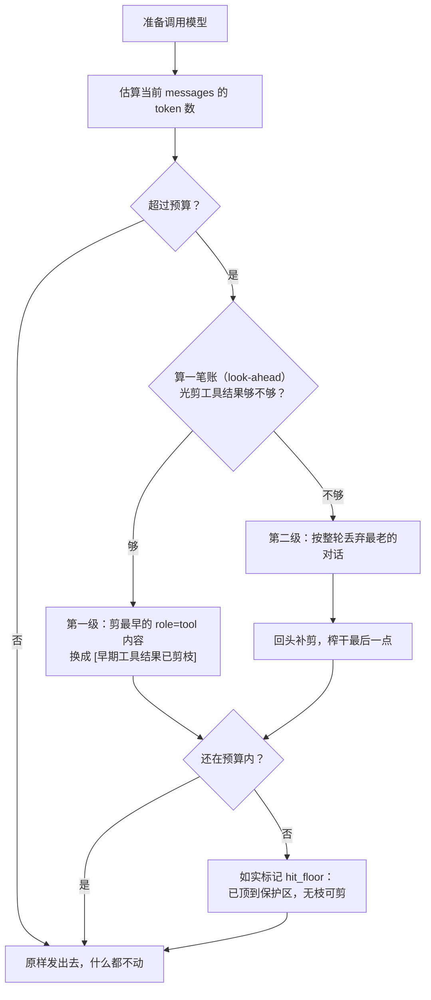

# hello-agent v2

> 第二个版本。v1 教你 Agent 是什么，v2 教你**为什么真实的 Agent 都需要上下文管理**。

v1 只有一句话原理：`Agent = LLM + 工具 + 循环 + 状态`。
v2 给最后那个「状态」加上了纪律。

---

## 🧪 先做实验，再看代码

**读代码是感受不到能力边界的，得亲手撞上去。**

### 👉 [EXPERIMENTS.md](EXPERIMENTS.md) —— 10 个实验，约 40 分钟

| 你会亲手验证什么 | 实验号 |
|---|---|
| 它自己会排步骤、报错能自己爬起来、帮你守住安全底线 | 1 ~ 3 |
| 它心算乘法错得有多离谱（而且**语气一样自信**） | 4 ⭐⭐ |
| 它为什么不知道「今天」 | 5 ⭐ |
| 它的能力上限到底卡在哪 | 6 ⭐ |
| **它怎么忘掉你刚说的事** —— 全程可视化 | 7 ⭐⭐⭐ |
| 一个环境变量怎么改变它的「人格」 | 8 |
| 它为什么会突然「强行收工」 | 9 |
| 改一句 20 字的中文，行为完全不同 | 10 ⭐⭐ |

> 每个实验都是：🎯 要感受什么 → ⌨️ 敲什么 → 👀 看什么 → 💡 所以呢

---

## 每一版都回答四个问题

这是这个系列的方法论：**不做为了炫技的升级，只解决上一版真实撞到的问题。**

### ① 上一版遇到了什么具体问题？

两个，一个是结构上的，一个是行为上的。

**问题 A（结构）：单文件撑不住。**

v1 的 `agent.py` 400 行，配置、工具协议、三个工具、主循环、CLI 五段混在一起。
想加第四个工具要在文件中间找位置，想调参数要翻到顶部，改一处得读全文。

**问题 B（行为，更严重）：上下文只增不减。**

| 症状 | 后果 |
|---|---|
| 每轮对话都 append，从不删 | token 随对话线性增长 |
| 工具返回的大块内容永久占位 | 一次目录列表躺到天荒地老 |
| 最终必然撞上模型上下文窗口 | **API 直接报错，而 v1 毫无准备** |
| 完全不知道当前用了多少 token | 零可观测性 |

> ⚠️ 这里有个容易被忽略的漏洞：v1 的 `MAX_ROUNDS = 8` **只保护单次提问内部的循环**，
> 对跨轮次的累积增长完全无能为力。聊得越久越危险 —— 而且 v1 里没有任何东西在盯着这件事。

### ② 这一版引入什么最小概念？

> **给上下文设一个 token 预算，超预算时优雅地「忘记」最不重要的部分。**

配上一次**纯重构**把文件拆开。拆文件不引入任何新行为 —— 这是刻意的：
让「上下文管理」成为 v2 唯一的变量，出问题你能立刻分清是重构引入的还是新功能引入的。

### ③ 如何验证它真的解决了？

`--selftest` 里 20 项断言，**不需要 API Key**。详见下面「验证」一节。

### ④ 下一版的新痛点是什么？

> **剪枝是不可逆的，剪掉就真没了。**

- 占位符里**没有任何信息**。模型后面若被问「你刚才读到的那个文件里写了什么」，它彻底答不出来
- v2 是**就地修改** messages 的，原始内容没被保存在任何地方
- 最讽刺的是：**越活跃的会话越早开始失忆，但恰恰是活跃会话最需要早前的信息**

**→ v3 方向**：把「丢弃」换成「压缩」—— 用 LLM 把即将被剪掉的那批消息概括成一条摘要，
用少量 token 保住关键信息。
**→ 再之后**：重启就全忘光，所以要持久化。

---

## 快速开始

沿用你机器上的 `myenv` 虚拟环境（依赖和 v1 完全相同，**零新增依赖**）。

```bash
myenv
cd agent-v2

# 先跑自检 —— 不需要 API Key
python main.py --selftest

# 开始对话
python main.py
```

**不需要复制 `.env`。** 配置分两层，各归各位：

| 层 | 文件 | 放什么 | 谁在用 |
|---|---|---|---|
| **共享层** | `<仓库根>/.env` | 密钥、接口地址、模型名 | 所有版本 |
| **版本层** | `agent-v2/.env` | v2 独有的上下文参数 | 可选，不存在也没关系 |

判断标准只有一句话：**「换个版本，这一项会不会变？」**

- 「连哪家 API、用哪个模型」→ 换版本不会变 → **共享层**
  （第一次用：在仓库根 `cp .env.example .env`，填入 `LLM_API_KEY`，只需一次）
- 「`MAX_CONTEXT_TOKENS` 这类 v2 才有的调参」→ 换版本会变 → **版本层**

v2 独有这三项，模板见 `agent-v2/.env.example`：

| 参数 | 默认 | 说明 |
|---|---|---|
| `LLM_MAX_CONTEXT_TOKENS` | 4000 | token 预算，超出就剪枝 |
| `LLM_KEEP_RECENT` | 8 | 最近多少条消息永不剪枝 |
| `LLM_MAX_TOOL_RESULT_CHARS` | 2000 | 单个工具返回值最多留多少字符 |

> **v1 不读这三项** —— 它没有上下文管理这个能力。所以它们不该塞进共享层，
> 否则共享 `.env` 会变成「每个版本往里堆自己参数」的大杂烩。

加载优先级（靠前的不会被后面的覆盖）：

| 优先级 | 来源 | 用途 |
|---|---|---|
| 1（最高） | 真实环境变量 | `LLM_MAX_CONTEXT_TOKENS=800 python main.py` 一次性实验 |
| 2 | `agent-v2/.env` | 可选，只放这个版本想覆盖的项 |
| 3（兜底） | `<仓库根>/.env` | ⭐ 平时只动这一个 |

想知道当前到底读到了什么？直接问它：

```bash
python main.py --config
```

会打印「加载了哪几个文件、每一项当前是什么值、属于哪个层」。

---

## 核心概念：两级剪枝



### ⭐ 最关键的一点：替换内容，而不是删除消息

这是本版最值钱的一条经验：

```python
# ❌ 错误做法：直接删掉这条 tool 消息
del messages[i]
# → API 报错：
#   messages with role 'tool' must be a response to a preceding
#   message with 'tool_calls'

# ✅ 正确做法：只把 content 换掉，消息本身留在原位
messages[i]["content"] = "[早期工具结果已剪枝]"
# → 结构完好（tool_call_id 仍能配对），token 却省下来了
```

OpenAI 协议要求每条 `role="tool"` 消息都能对应上前面某条 assistant 消息里的
`tool_call_id`。**删掉 tool 消息会让配对断掉**，而只换 content 则天然保持完好。

### 两条护栏

| 护栏 | 作用 |
|---|---|
| **当前轮永不动** | 最后一条 `user` 消息之后的内容一律不剪 —— 那正是模型马上要用的 |
| **源头限流** | 单个工具返回值超 2000 字符就地截断。与其事后剪，不如一开始就别让它进来 |

### 关于「算一笔账」（look-ahead）

通常先做第一级（伤害更小），但**动手前会先算一笔账**：如果预判光剪工具结果
根本不够，就直接跳到第二级。

这不是纸上谈兵。最早的版本是无条件「先剪再丢」，**实测跑出来是这样**：

```
剪枝 18 条工具结果，丢弃 18 轮旧对话（20,826 → 2,214 tokens）
✗ 剪枝后回到预算内（2,214 ≤ 2,000）
✗ 确实有 0 条工具结果被替换成占位符
```

第一级剪掉的 18 条，恰好就是第二级马上要整轮删掉的那批 —— **白忙一场**，
而且剪枝报告还因此撒了谎：显示剪了 18 条，实际一条都没留下。
加上 look-ahead 之后，这个场景变成「直接丢整轮」，报告也诚实了。

---

## 文件结构

```
agent-v2/
├── main.py       CLI 入口：交互界面、/context 命令、--selftest
├── agent.py      Agent 主循环（v1 §4 的迁移，只加了两处钩子）
├── context.py    ⭐ 本版核心：token 预算 + 两级剪枝
├── llm.py        LLM 调用封装：统一拿 reply + usage
├── tools.py      工具协议 + 3 个工具（v1 §2+§3 原样搬迁，行为零变化）
└── config.py     配置：所有可调参数集中
```

依赖方向单向、无循环：

```
main.py ──→ agent.py ──→ context.py ──→ config.py
              │              │
              ├──→ llm.py ───┤
              │       │      │
              └──→ tools.py ─┘
```

拆开的理由很简单：**每一层只回答一个问题**。
`config` 回答「参数是多少」，`tools` 回答「能做什么」，`llm` 回答「怎么跟模型说话」，
`context` 回答「该记住多少」，`agent` 回答「怎么编排」，`main` 回答「怎么跟人交互」。

---

## 新增的配置项

三项都属于**版本层**（写在 `agent-v2/.env` 里，可选），不填就用这些默认值：

```bash
# messages 的 token 预算，超出就开始剪枝
LLM_MAX_CONTEXT_TOKENS=4000

# 最近多少条消息永不剪枝
LLM_KEEP_RECENT=8

# 单个工具返回值最多保留多少字符
LLM_MAX_TOOL_RESULT_CHARS=2000
```

> ⚠️ `LLM_MAX_CONTEXT_TOKENS` **故意默认 4000（很小）**，这样你随便聊几句就能看到剪枝工作。
> 生产环境请改成「模型真实上下文窗口 × 0.7」：64K 的模型设 `45000`，128K 的设 `90000`。

---

## 验证

### 离线（不需要 API Key）

```bash
python main.py --selftest
```

20 项断言，分三组：

**① 工具层（2 项）** —— 用 v1 完全相同的用例，证明「拆文件是纯重构」
**② token 估算器（4 项）** —— 确定性输入输出
**③ 上下文剪枝（14 项）** —— 三个场景：

| 场景 | 断言 |
|---|---|
| A. 只触发剪内容 | 条数不变、无孤儿 tool 消息、**剪掉的原样保留** |
| B. 预判剪不够 → 先丢整轮 | 回到预算内或如实标记 `hit_floor`、**没有白忙一场**、无孤儿消息 |
| C. 未超预算 | **完全不动**（不误伤） |

其中这几条是最值钱的 —— 它们正是 API 会替你检查、但报错信息极难懂的东西：

- `剪枝后无孤儿 tool 消息，结构健康`
- `最后一条 user 之后的内容一字未动（当前轮受保护）`
- `第 0 条仍是 system 消息`
- `剪掉的工具结果原样保留在上下文里，没有被丢弃`

### 在线（需要 API Key）

把预算调到很小，**主动制造剪枝**，验证它真的会工作：

```bash
LLM_MAX_CONTEXT_TOKENS=800 python main.py
```

然后随便聊几句，观察终端出现 `✂ 剪枝 ...`。再输入 `/context` 看实时占用：

```
上下文 约 780 / 800 tokens（98%）· 共 14 条消息
历史累计剪枝  3 条工具结果
结构自检      健康
```

> 💡 注意对照观察：每轮会显示 **两个** token 数字 ——
> `· 本次请求 1,234 tokens` 是 API 返回的**真实值**，
> `上下文 约 1,180 / 4,000 tokens` 是我们的**估算值**。
> 两者的差距就是估算误差，一般 ±20% 以内。估算负责「要不要剪」的前瞻决策，
> 真实值负责让你知道到底花了多少钱。

---

## 常见问题

**Q：`--selftest` 提示 `hit_floor`，是不是坏了？**
不是。它表示「两级剪枝都用尽了，但仍然超预算」—— 因为你设置的预算太小，
剩下的内容全都落在「最近消息保护区」里不能动。这是主动保护最近上下文的结果，
不是 bug。真实环境里预算会设得比内容大得多，很少触发。

**Q：怎么让剪枝别那么频繁？**
把 `LLM_MAX_CONTEXT_TOKENS` 调大，或把 `LLM_KEEP_RECENT` 调小。

**Q：模型报「context length exceeded」怎么办？**
说明预算设得比模型真实窗口还大。把 `LLM_MAX_CONTEXT_TOKENS` 调到
「模型窗口 × 0.7」左右。

**Q：剪枝之后模型答不上来了，正常吗？**
正常，而且这正是 v3 要解决的问题 —— 见下面第 ④ 个问题。

---

## 动手练习

1. **把预算调到 100** —— 观察它会怎样一路把上下文压到只剩当前轮。这是极端情况的边界测试
2. **加一个 `/history` 命令** —— 把当前的 `messages` 完整打印出来，肉眼看看剪枝后的样子
3. **换一个剪枝策略** —— 试试「保留最早的 N 条 + 最近的 N 条，只剪中间那一段」，
   想想它和现在的「从最早开始剪」各有什么优劣
4. **给剪枝加个存档** —— 被剪掉的原始内容写到一个文件里。这就是 v3「压缩代替丢弃」的雏形
5. **观测估算误差** —— 聊十几轮，把每轮的两个 token 数字抄下来算算平均误差

---

## v1 到哪里去了？

没删。`agent-v1/` 原样保留，它是最好的对照组：

```bash
diff -u ../agent-v1/agent.py agent.py     # 看主循环改了什么
```

你会发现 `Agent.run()` 几乎没变 —— **只在两处加了钩子**（请求前 `prepare()`、
工具结果截断）。这就是拆文件 + 分层带来的好处：加一个横切关注点，
不需要改主循环的结构。
