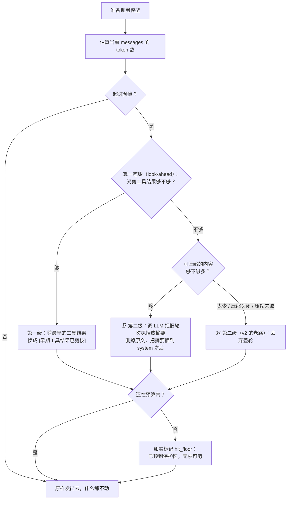

# hello-agent v3

> 第三个版本。v1 教你 Agent 是什么，v2 教它别撑爆上下文，v3 教它**别把记忆扔了**。

v2 管住了 token，代价是**失忆**：超预算就把最老的对话整轮删掉。
v3 只改这一处 —— **删之前，先让 LLM 把它概括成一条摘要。**

---

## 🧪 先做实验，再看代码

**「它记住了」这件事，读代码是感受不到的，得亲手验证。**

### 👉 [EXPERIMENTS.md](EXPERIMENTS.md) —— 9 个实验，约 45 分钟

| 你会亲手验证什么 | 实验号 |
|---|---|
| 同一个 Agent，昨天忘掉的暗号今天还记得 | 1 ⭐⭐⭐ |
| 摘要里到底写了什么 —— 它的「记忆」长什么样 | 2 ⭐⭐ |
| 亲手把压缩关掉，看它怎么又失忆了 | 3 ⭐⭐ |
| **压缩花的钱，比省下的 token 还多？** —— 那它图什么 | 4 ⭐⭐⭐ |
| 压了又压之后，最早的记忆还剩多少 | 5 ⭐⭐⭐ |
| 把摘要模板改坏，看保真度怎么崩 | 6 ⭐⭐ |
| 压缩失败的那一刻，它会崩吗 | 7 |
| 摘要长度旋钮：短了丢信息，长了不省 token | 8 |

> 每个实验都是：🎯 要感受什么 → ⌨️ 敲什么 → 👀 看什么 → 💡 所以呢

---

## 每一版都回答四个问题

这是这个系列的方法论：**不做为了炫技的升级，只解决上一版真实撞到的问题。**

### ① 上一版遇到了什么具体问题？

**剪枝是不可逆的。剪掉就真没了 —— 而且它忘得很安静。**

v2 的 `_drop_oldest_rounds()` 把旧对话整轮 `del` 掉。删掉的内容
**不保存在任何地方**，占位符里也没有一丝信息。

v2 自己写的实验 7 就演示过：让它记住「紫色河马」，聊 8 轮无关的，
再回头问 —— 它答不上来，而且**没有任何报错**。

**这不是理论推演，是 v3 动手前先跑出来的对照**（同一段对话、同一套参数）：

| | 压缩开启 | 压缩关闭 |
|---|---|---|
| 中途 | `🗜 第 1 次压缩：5 轮旧对话 → 摘要 161 tokens` | `✂ 丢弃 4 轮旧对话（内容不再保留）` |
| 最后问「暗号是什么」 | **「你让我记的暗号是『紫色河马』。」** ✅ | **「你并没有让我记过任何暗号」** ❌ |

> 注意第二列的下场：它不只答不上来，还**编了一段解释**说「你先后问了水的沸点、
> 让我算了几道题，从没提过暗号」—— 语气一样自信。
> 这就是 v2 的失忆在真实对话里的样子。

### ② 这一版引入什么最小概念？

> **丢弃之前，先让 LLM 把它概括成一条摘要。**

```
v2:  旧对话 ─────────────────────────→ （删除，信息量 = 0）
v3:  旧对话 ─→ LLM 概括 ─→ 摘要文本 ─→ （插入上下文，信息量 > 0）
```

就这么一处改动。第一级「剪工具结果」、两条护栏、look-ahead 算账 —— 全部原样保留。

**连带长出来的东西是「记忆分层」**（不是新概念，是压缩的必然结果）：

| | 是什么 | 特点 |
|---|---|---|
| **长期记忆** | 一条 `system` 摘要消息，固定在 index 1 | 很省 token，保留关键结论 |
| **短期记忆** | user / assistant 的原始消息 | 完整精确，但很贵 |

最近的看得清，久远的只剩素描。**这不是「上下文变短了」，
而是「上下文按重要程度分了档」。**

### ③ 如何验证它真的解决了？

`--selftest` 里 **45 项断言，不需要 API Key，不花一分钱**。详见下面「验证」一节。
其中最值钱的一条是 **D2 的对照组**：

- 同一个「埋了暗号的超长历史」，两个 ContextManager 各跑一遍
- 装了压缩器的：`v3 的上下文里还能找到它` ✅
- 没装的：`v2 把暗号彻底弄丢了` ✅

**一个测试里同时断言「新行为对」和「旧行为错」** —— 这样它就没法偷偷退化成 v2。

另外还有真实模型跑出来的对照（上面那张表），数据在 `EXPERIMENTS.md` 里。

### ④ 下一版的新痛点是什么？

> **摘要只活在这一个进程里。重启，全忘。**

压缩解决的是「聊得久了会忘」，但摘要本身躺在 `self.summary_text` 这个
Python 变量里 —— 关掉终端就没了。会话之间也不共享任何东西。

而且 v3 还留了几个更细的坑：

| 坑 | 说明 |
|---|---|
| **压缩不是免费的** | 实测：花 789 tokens 换回 150 tokens 的节省。钱是靠「保信息」赚的，不是靠省 token |
| **压了又压会漂移** | 每次压缩都是有损转换，第三次压完，第一次的细节已经很淡了 |
| **预算太小时压不动** | 摘要 + 保护区本身就快撑满预算，没有可压的空间 |
| **估算器不算 tools schema** | 估算 501 时真实请求已经 1,002 —— 固定开销约 400 tokens 没被算进去 |

**→ v4 方向**：把 `messages` 和摘要存到磁盘，重启后读回来 —— **持久化记忆**。
**→ 再之后**：它只记得「你告诉过它的事」，记得不了「你的资料」→ 本地检索（RAG）。

---

## 快速开始

沿用你机器上的 `myenv` 虚拟环境（依赖和 v1/v2 完全相同，**零新增依赖**）。

```bash
myenv
cd agent-v3

# 先跑自检 —— 不需要 API Key，不花钱
python main.py --selftest

# 开始对话
python main.py
```

**不需要复制 `.env`。** 配置分两层，各归各位：

| 层 | 文件 | 放什么 | 谁在用 |
|---|---|---|---|
| **共享层** | `<仓库根>/.env` | 密钥、接口地址、模型名 | 所有版本 |
| **版本层** | `agent-v3/.env` | v3 独有的上下文 / 压缩参数 | 可选，不存在也没关系 |

判断标准只有一句话：**「换个版本，这一项会不会变？」**

v3 独有这四项，模板见 `agent-v3/.env.example`：

| 参数 | 默认 | 说明 |
|---|---|---|
| `LLM_MAX_CONTEXT_TOKENS` | 4000 | token 预算，超出就瘦身 |
| `LLM_KEEP_RECENT` | 8 | 最近多少条消息永不剪、也永不压 |
| `LLM_MAX_TOOL_RESULT_CHARS` | 2000 | 单个工具返回值最多留多少字符 |
| `LLM_SUMMARY_ENABLED` | 1 | 压缩开关（0 = 退回 v2 的丢弃）|
| `LLM_SUMMARY_MODEL` | 跟随 `LLM_MODEL` | 压缩用哪个模型（可以更便宜）|
| `LLM_SUMMARY_MAX_TOKENS` | 500 | 摘要输出上限 |
| `LLM_MIN_COMPACT_TOKENS` | 200 | 少于这么多 token 的可压内容就不压 |

加载优先级（靠前的不会被后面的覆盖）：

| 优先级 | 来源 | 用途 |
|---|---|---|
| 1（最高） | 真实环境变量 | `LLM_MAX_CONTEXT_TOKENS=500 python main.py` 一次性实验 |
| 2 | `agent-v3/.env` | 可选，只放这个版本想覆盖的项 |
| 3（兜底） | `<仓库根>/.env` | ⭐ 平时只动这一个 |

想知道当前到底读到了什么？直接问它：

```bash
python main.py --config
```

---

## 核心概念：压缩替代丢弃



### 摘要长什么样

压缩完之后，上下文变成：

```
[0] system   你是一个可以通过调用工具来完成任务的助手……   ← 不动
[1] system   【早前对话摘要 · 由系统自动压缩生成，不是用户的新输入】
             【对话摘要】
             目标：用户在测试助手的记忆力。
             关键信息：用户交代的暗号是「紫色河马」。
             已确认的事实：1234 × 5678 = 7006742；……
             未完成：无
             【早前摘要结束，以下是本次对话的后续内容】        ← 长期记忆
[2] user     请记住这个暗号：紫色河马……                    ← 短期记忆开始
[3] assistant ...
```

三个设计细节：

1. **头尾标记**：告诉模型「这是压缩过的旧记忆，不是新的用户输入」。
   没有边界的话，模型很容易把摘要当成一条新指令来处理。
2. **结构化模板**：压缩指令里写死了「目标 / 关键信息 / 已确认的事实 / 未完成」四类。
   如果只说「请概括一下」，模型会给你一段读起来很顺、但把暗号丢掉的文章。
3. **`system` 而不是 `user`**：摘要不能被 `_drop_oldest_rounds()` 当成某轮的起点误删 ——
   轮次的分界线永远在 `user` 消息上。

### 滚动合并：压了又压怎么办

第二次触发压缩时，**旧摘要会和新内容一起被送进去**：

```python
result = self.summarizer.summarize(chunk, self.summary_text)
#                                          ^^^^^^^^^^^^^^^^^ 旧摘要
```

压缩指令里也明确要求「输出合并后的完整摘要，不要重复、也不要遗漏」。

少了这一步，每次压缩都会把上辈子的记忆冲掉 —— 那就不是压缩，
是换一种方式失忆。`--selftest` 的 D3 就是专门盯这件事的：
压两次，两个暗号都必须还在。

### 压缩失败怎么办

**这是工程底线：压缩挂了，绝不能让用户的对话跟着挂。**

```python
try:
    result = self.summarizer.summarize(chunk, self.summary_text)
except Exception as exc:
    # 降级到 v2 的老办法（丢弃），对话照常继续
    report.compaction_error = f"{type(exc).__name__}: {exc}"
    self.compaction_failures += 1
    report.dropped_rounds += self._drop_oldest_rounds()
    return
```

网络抖一下、模型名写错、配额用完 —— 都会走到这里。
代价是「这一刻它又回到了会失忆的状态」，但**对话没有中断**。
`--selftest` 的 D4 用假摘要器抛异常来验证这条路。

---

## 压缩到底划不划算？（实测）

这是本版最值得记住的一笔账。真实模型跑出来的数字：

```
🗜 第 1 次压缩：5 轮旧对话（14 条消息） → 摘要 161 tokens，压缩比 52%
上下文 501 → 409 tokens
压缩调用：608 输入 / 181 输出 tokens · 耗时 1.2s
```

| | 数字 |
|---|---|
| **花掉** | 608 + 181 = **789 tokens**（一次压缩调用） |
| **省下** | 约 **150 tokens**（被压内容 − 摘要） |

**单看这一次，是亏的。**

那为什么还要压？因为省下的是**每回合都在兑现的**：

- 丢弃省的 token 只兑现一次，然后信息永远没了
- 压缩省的 token 每一轮请求都在省，而信息**还在那儿**

所以正确的描述不是「压缩省钱」，而是：

> **压缩是用「一次性的、可接受的开销」，换「长期的信息存续」。**

真要靠压缩省钱，得压大块内容 —— 这也是为什么代码里有个
`MIN_COMPACT_TOKENS`（默认 200）：内容太短时，压缩的固定开销
（指令约 250 tokens + 摘要输出）根本摊不平，那就干脆别压，直接丢。

---

## 文件结构

```
agent-v3/
├── main.py         CLI 入口：交互界面、/summary 命令、--selftest（45 项断言）
├── agent.py        Agent 主循环（和 v2 几乎一样，只多了一行压缩提示）
├── context.py      ⭐ 上下文管理：第一级剪枝 + 第二级压缩 / 丢弃
├── compaction.py   ⭐⭐ 本版核心：摘要器（Summarizer 接口 + LLM 实现）
├── llm.py          LLM 调用封装：+ max_tokens、+ 压缩单独记账
├── tools.py        工具协议 + 3 个工具（相对 v2 零改动）
└── config.py       配置：所有可调参数集中
```

依赖是**单向**的，从下往上，没有循环：

```
config.py     ← 谁都能读它，它不读任何人
   ↑
tools.py      ← 工具协议 + 三个工具
   ↑
llm.py        ← 调模型，顺带记账（对话 / 压缩分开记）
   ↑
compaction.py ← 把消息压成摘要（唯一依赖 llm 的地方）
   ↑
context.py    ← 管 messages：剪枝 + 压缩 + 兜底
   ↑
agent.py      ← 主循环
   ↑
main.py       ← CLI
```

**为什么要单独开一个 `compaction.py`？** 因为它回答的是一个独立的问题：
「怎么把一段对话变成一段摘要」。`context.py` 关心的是「什么时候该压、
压多少、压不动怎么办」——**决策**和**执行**分开，
测试的时候才能塞一个假的压缩器进去，把整条流水线离线跑穿。

---

## 验证

### 离线（不需要 API Key，不花钱）

```bash
python main.py --selftest
```

45 项断言，分四组：

**① 工具层（2 项）** —— 用 v1 完全相同的用例，证明老功能没被碰坏
**② token 估算器（4 项）** —— 确定性输入输出
**③ 剪枝（6 项，v2 的老本事）** —— 只换 content 不删消息、无孤儿 tool 消息
**④ 压缩（33 项，v3 的核心）** —— 七个场景：

| 场景 | 关键断言 |
|---|---|
| **D1** 超预算 → 压缩 | 摘要插在 index 1、**暗号被保住**、原文已删、结构健康、当前轮未动 |
| **D2** 对照组（无压缩器） | 走丢弃路径、**日志写明「压缩被关闭」**、**暗号彻底消失** |
| **D3** 压第二次 | **两个暗号都还在**（旧摘要被合并）、摘要始终只占一条 system 消息 |
| **D4** 压缩失败 | 异常被接住、自动回退丢弃、账本记对、结构健康 |
| **D5** 值不值得压 | 内容太少 → 一次都不调；阈值调大 → 该压的也不压（**日志写明原因**） |
| **D6** 压一次就够 | 连续 prepare 三次，压缩器调用次数不变 |
| **D7** 没东西可动 | 一个字都不动，但**不沉默**：日志说明「可动的只剩保护区」 |

其中两组是刻意设计的对照：

- **D2**：在同一个测试里，一边断言新行为对、一边断言旧行为错
- **D5 / D7**：断言「没做动作时，日志必须把原因说出来」——
  只写了动作的日志是不完整的，它得能自证清白

### 在线（需要 API Key）

```bash
LLM_MAX_CONTEXT_TOKENS=500 LLM_KEEP_RECENT=4 python main.py
```

然后随便聊 8 轮，你会看到真实的压缩现场：

```
你 >   🗜 正在压缩旧对话…（这一步要额外调一次模型）
  🗜 第 1 次压缩：5 轮旧对话（14 条消息） → 摘要 161 tokens，压缩比 52%
  上下文 501 → 409 tokens
  压缩调用：608 输入 / 181 输出 tokens · 耗时 1.2s
  上下文 约 409 / 500 tokens（82%） · 共 10 条消息 · 摘要 161 tokens
```

反过来，如果它**没**压，日志也会告诉你为什么 —— 比如你的可压内容只有 183 tokens、
而阈值是 200 时：

```
你 >   ✂ 丢弃 1 轮旧对话（内容不再保留）
  ⏭ 没有走压缩：可压内容只有 183 tokens，低于阈值 200（调小 LLM_MIN_COMPACT_TOKENS 就会压）
  上下文 1,043 → 860 tokens   ⚠ 已顶到保护区，没东西可动了
```

两个新命令：

- `/summary` —— **打开它的记忆看看**。摘要全文，压缩产物的真身
- `/context` —— 现在会多报：摘要占多少 token、压缩过几次、花了多少

> 💡 注意对照观察：每轮会显示 **两个** token 数字 ——
> `· 本次请求 1,002 tokens` 是 API 返回的**真实值**，
> `上下文 约 578 / 600 tokens` 是我们的**估算值**。
>
> ⚠️ 这次误差比 v2 大得多，原因很具体：**估算器没有把 tools schema 算进去**。
> 那三个工具的 JSON Schema 是每次请求都要带的固定开销，约 400 tokens。
> 所以预算设得很小时（几百 token），这个固定开销会显得误差特别吓人。
> 这不算 bug —— 但你应该知道这件事，而不是被数字搞晕。

---

## 常见问题

**Q：为什么它还是忘事了？明明开着压缩。**

**现在不用猜了 —— 日志会直接告诉你。** 紧跟在那句 `✂ 丢弃` 后面的
`⏭ 没有走压缩：…` 就是在回答这个问题：

| 日志显示 | 意思 |
|---|---|
| `⏭ 没有走压缩：可压内容只有 X tokens，低于阈值 Y` | 这笔账算不过来 → 直接丢。想让它压：把 `LLM_MIN_COMPACT_TOKENS` 调小 |
| `⏭ 没有走压缩：记忆压缩被关闭了（LLM_SUMMARY_ENABLED=0）` | 开关没开 |
| `⏭ 没有走压缩：没有可压缩的完整轮次（…保护区…）` | 能动的只剩保护区，连丢弃都无从下手 |
| `⚠ 压缩失败：…（已回退到「丢弃」）` | 压缩调用报错了：模型名写错 / 网络 / 配额 |
| 出现了 `✂ 丢弃`，但**既没有 `⏭` 也没有 `⚠`** | 不该发生 —— 说明有条岔路漏了报原因，当 bug 处理 |
| 什么报告行都没出现 | 没超预算，压根没瘦身 —— 它可能是**真的**没记住 |

> 最后两行的区别很关键：**「没动作」和「动作了但说不清」是两回事。**
> 日志的价值就在这儿 —— 它得能自证清白，而不是让你去猜。

**Q：`hit_floor` 是什么？**
「两级都用尽了还是超预算」。压缩之后剩下的内容（摘要 + 最近保护区）
本身就撑满了预算，没有可动的空间了。把预算调大一些即可。

**Q：摘要会不会越压越大？**
会缓慢变大（每次都要把旧摘要吞进来再吐出来）。但 `LLM_SUMMARY_MAX_TOKENS`
卡着上限，而且压缩指令里明确要求「必须简短」。真到 `hit_floor` 了，
说明该调大预算，而不是继续压。

**Q：能不能只用便宜模型做压缩？**
能，而且这是真实产品里的常规操作：

```bash
LLM_SUMMARY_MODEL=gpt-4o-mini python main.py
```

「把一段话读短」比「调用工具完成任务」简单得多，小模型往往够用。

**Q：`/reset` 之后摘要还在吗？**
不在。摘要属于历史的一部分，`/reset` 会一起清掉 —— 但它**在统计里留了痕**
（`压缩记录` 那一行），因为那是「这个进程干过多少活」的账。

---

## 动手练习

1. **读一读真实的摘要**：跑一段长对话，然后 `/summary`。
   看看它保住了什么、漏了什么。**漏掉的东西比保住的东西更有信息量** ——
   它告诉你现有模板的偏好
2. **改摘要模板**：把 `compaction.py` 里 `COMPACTION_INSTRUCTION` 的
   输出格式加一条「用户情绪」，看摘要会变成什么样
3. **给压缩加超时**：压缩卡住时现在只能等。给它一个超时 + 回退，会发现
   「失败兜底」这条路其实早就铺好了
4. **统计压缩收益**：把每次压缩的「花掉」和「省下」记下来，
   聊 30 轮之后算总账，看这个 Agent 是赚了还是亏了
5. **让压缩也压工具结果**：现在被压缩的轮次里，工具结果是一起进摘要的。
   如果摘要模型保留太多工具原始输出，压缩比会很差 —— 试着在
   `render_history()` 里把它截断

---

## v2 到哪里去了？

没删。`agent-v2/` 原样保留，它是最好的对照组：

```bash
diff -u ../agent-v2/context.py context.py     # 看「丢弃」怎么变成「压缩」
```

你会看到改动的核心其实很短 —— `_drop_oldest_rounds()` 变成了
`_compact_or_drop()`，多了一个 `_compactable_span()` 决定压哪一段。
**其余 200 行代码一行没动。**

这就是每一版「只动该动的地方」的好处：出了问题，排查范围就是那个 diff。
