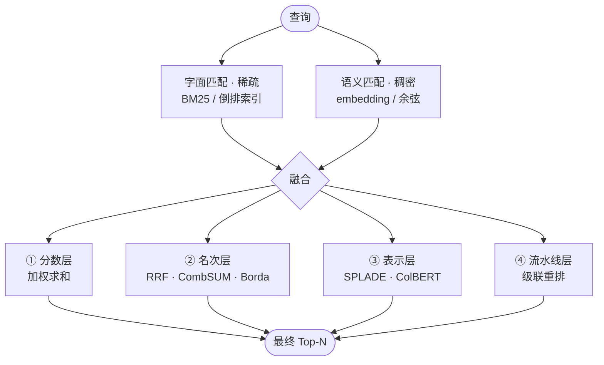

# 混合检索原理手册

> 这是 v7 的**背景课**。不教 API 用法，只讲原理 ——
> 向量到底怎么工作、关键词为什么对精确串稳、五种混合思路各自在「哪一层」缝合。
>
> 读完它，v7 的每一行代码你都能说出「为什么是它，而不是别的」。
>
> ⚠️ 文中涉及社区方案的部分，来自模型知识（2026-09 核对）——可能过时，
> 查到官方文档时以文档为准。

---

## 0. 先建立一个坐标系

知识散落着学会散架，先给架子。任何检索系统，都可以用**三个轴**描述：

**轴 1 · 拿什么比？** —— 字面（这个词出现了没有）还是语义（意思像不像）

**轴 2 · 在哪一层合？** —— 分数层 / 名次层 / 表示层 / 流水线层 / 查询层
（这就是「各种混合方式」的分类依据，下半篇全在讲它）

**轴 3 · 花什么代价？** —— 免费 / 按 token 付费 / 每个候选一次模型调用

整个领域二十年的演化，就是两个家族各自壮大、然后大家发现**谁也打不死谁**，
于是在轴 2 的不同层上想办法合。全景图：



（还有第五层「查询层」：在问题端做文章 —— 见 §3.5。）

---

## 1. 向量是怎么工作的（从零）

### 1.1 要解决的问题

计算机只会比较：比字节、比数字。它天生会判断「两个字符串一样不一样」，
但「怎么让它更快」和「性能优化」在字符串层面**一个共同字符都没有** ——
这是关键词检索的物理上限（你在 v5 亲手撞过：0 命中）。

所以真正的需求是：**能不能给「意思」造一把尺子？**

### 1.2 核心魔法：把「意思」变成「位置」

embedding 的全部思想可以压缩成一句话：

> **给每段文字在一张超大的地图上钉一个图钉。意思近的，图钉钉得近。**

文字不能比，那就**不再比文字** —— 比图钉的位置。位置是数字，数字可以计算、可以排序。

这个「地图」就是高维空间。本项目用的 `bge-m3` 输出 1024 个数字，
就是地图上的 1024 个坐标：

```
「性能优化…」        → [ 0.12, -0.03, …,  0.44]   ┐ 位置接近（余弦 0.65）
「怎么让它更快」      → [ 0.11, -0.02, …,  0.41]   ┘
「番茄需要浇水」      → [-0.31,  0.22, …, -0.08]     位置很远（余弦 0.36）
```

于是「找相关内容」变成了**找夹角最小的向量** —— 一个纯几何问题，
跟「字面像不像」彻底无关。

### 1.3 这串数字从哪来：embedding 模型

「意思近的钉得近」不是天上掉的，是**练出来的**。

训练过程（对比学习）一句话版：给它看一对真搭子 ——「今天下雨了」+「外面正在下雨」，
告诉它「这两个该在一起」；再塞给它一个乱配的 ——「今天下雨了」+「披萨怎么做」，
告诉它「这个推开」。这种配对数据（翻译对、问答对、同义句、同一篇文章的相邻段落……）
网上海量。练上千亿次后，模型把「什么和什么可以互相替换、经常一起出现」
刻进了自己的参数里。

本质上是：**「观其伴，知其义」** —— 一段文字的意思，由它常出现的搭档决定。
它是统计机器，不是词典。由此推出两个**极其重要**的性质：

1. **它学的是统计规律，不是真理。** 训练数据里没见过的东西（内部代号、
   报错编号、新词）没有位置可参考，只能按「长得像谁」猜 —— 这就是
   `ERR_5002` 翻车的根源（实测：余弦只有 0.556，门槛一抬就死）。
2. **「像」不等于「对」。** 训练数据里「设备故障」和「重启试试」总一起出现，
   模型就认为它们相似 —— 哪怕那次重启根本没用。

### 1.4 ⚠️ 别去解读单个维度

新手最容易犯的错：问「1024 个数字里，第 37 个代表什么？」

答案是：**不代表什么。** 每个维度没有一个人类可读的名字。「意思」是集体编码
在整串数字里的，像一幅画的 1024 个像素 —— 问「第 37 个像素是什么」没有意义，
整幅图才有意义。

### 1.5 怎么量两个图钉「近不近」：余弦相似度

直觉：把两个向量画成两支从原点出发的箭，看**夹角**：

- **夹角 0°（cos = 1）**：完全同向 —— 意思基本一样
- **90°（cos = 0）**：垂直 —— 毫不相干
- **反向（cos 负）**：意思相反（实际模型里很少出现）

公式就是点积除以两个长度：

$$\cos(\vec{q}, \vec{d}) = \frac{\vec{q} \cdot \vec{d}}{\lVert \vec{q} \rVert \, \lVert \vec{d} \rVert}$$

**为什么不用欧氏距离？** 向量的「长度」受文本长短、常见度影响很大 ——
一篇长文和一句短问句的向量长度差很多，但方向可以很接近。
检索要的是**方向**，不是长度。（代码里 `cosine()` 的注释说的就是这个。）

翻译成人类尺度：实测里「性能优化」和「怎么让程序跑得更快」的余弦是 0.6565，
大约 49°；和「番茄浇水」是 0.4157，大约 65°。
**相关和不相关之间，角度只差十几度** —— 所以绝对分数非常难解读。

### 1.6 ⭐ 关键领悟：向量分数只在自己「那一场考试」里有意义

v6 实测的分数分布（同一场查询里，从高到低）：

```
0.787  ← 真的相关
0.651
0.580
0.425
0.362  ← 「番茄浇水」，完全不相关
```

注意：**连完全不相关的那一段，都拿到了 0.362。** 这个绝对值单看一点都不低 ——
只有当它和同场其他分数排在一起时，你才知道它不相关。

三条推论，全都直接决定 v7 的设计：

1. **门槛没有普适值。** `LLM_MIN_SIMILARITY` 换模型、换语料就要重新校准。
2. **绝对不能和别的分数直接相加。** 余弦是 0~1 且挤在 0.3~0.8 之间，
   BM25 打分是 0 到几不等 —— 两把尺子，一个量体温一个量身高。
   把 0.65 和 2.4 加起来，得到的数字什么都不是。**这是 RRF 存在的全部原因。**
3. **换模型 = 换坐标系。** 同一个句子，换一个 embedding 模型，坐标毫无关系，
   混用就是噪音（代码里缓存按 `model_id` 分区，防的就是这个）。

### 1.7 向量检索的软肋清单（全部源自「训练出来的」）

| 软肋 | 实测证据（本项目） |
|---|---|
| **没见过的串只能猜** | 同一条笔记里的两个编号：`X1000-3` 余弦 0.617 活、`ERR_5002` 0.556 死（门槛 0.6） |
| **花钱** | 按 token 计费 → 必须缓存；查询词每次约 5 tokens（`store=False` 不缓存它的原因） |
| **门槛不普适** | 0.5 和 0.6 之间就生死两隔 |
| **假阳性倾向** | 任何两段文字都能算出「还不错」的分数（番茄 0.362） |
| **不可解释** | 只能说 0.65，说不清**为什么**是这段 |

---

## 2. 关键词那边（对称复习）

### 2.1 三件套

- **倒排索引**：像书后面的索引 ——「err_5002 → 出现在第 3 段」。查词不读全文，直接翻索引。
- **TF 饱和**：一个词出现 10 次，不等于相关 10 倍（代码里 `tf / (tf + 1.5)`）。
- **IDF**：越罕见的词越值钱。`err_5002` 全库只出现一次 → IDF 极高 →
  **字面一出现，稳如泰山**。

### 2.2 术语桥：稀疏 vs 稠密

这是把两套知识缝起来的关键：**关键词检索其实也能写成向量。**

想象一个「词表维度」的向量 —— 比如 10 万维，每一维对应一个词：

```
「设备 ERR_5002 故障」的向量：
[0, 0, …, 0.7(第 31027 维), 0, 0.2(故障), …]   ← 十万维里只有几个非零
```

这叫**稀疏向量**（sparse）：绝大多数位置是 0，非零位置 = 出现过的词。
BM25 打分差不多就是这个稀疏向量的内积。

而 embedding 是**稠密向量**（dense）：1024 维，每一维都有值，密密麻麻。

> ⭐ 所以「混合检索」（hybrid search）的准确含义是：**稀疏 + 稠密一起用**。

### 2.3 两边照镜子

| | 关键词（稀疏） | 向量（稠密） |
|---|---|---|
| 匹配条件 | 字面出现 | 方向夹角小 |
| 强项 | 型号 / 编号 / 代码：`ERR_5002` 稳如泰山 | 换说法：`怎么让程序跑得更快` 命中 0.651 |
| 弱项 | 词汇鸿沟 —— 用词不同就是 0 命中 | 精确串靠猜；假阳性 |
| 成本 | 零 | 按 token 付费（有缓存） |
| 可解释 | 「命中了 err_5002 这个词」 | 「相似度 0.65」（说不出为什么） |
| 失败方式 | 宁缺毋滥（0 命中） | 宁滥毋缺（都像相关） |

看出重点了吗：**两边的盲区几乎不重叠。** 一个漏同义、一个漏精确；一个保守、
一个冒进。这就是「为什么必须混合」的全部底气 —— 不是贪心，是互补。

---

## 3. 混合的五种思路（本手册主菜）

先看一段小历史（据我了解）：90 年代 BM25 称王；约 2019~2020 年神经检索
证明「学出来的稠密向量」真能打；然后大家发现两家始终打不死对方 ——
**2021 年之后，「混合 + 融合」成了工程界默认答案**；到 RAG 时代，
又叠上了「重排」这一层。下面五种思路，就是「在哪一层合」的五种回答。

### 3.1 思路一：分数层融合（加权求和）

最直觉的做法：两个分数加起来。

$$\text{score}(d) = \alpha \cdot \hat{s}_{\text{向量}}(d) + (1 - \alpha) \cdot \hat{s}_{\text{关键词}}(d)$$

但**「直接加」会死得很难看**（§1.6 已论证量纲问题）：BM25 给 A 打 2.4、
给 B 打 0.3；余弦给 A 打 0.65、给 B 打 0.61。直接相加，A=3.05、B=0.91 ——
表面上关键词说了算，实际上是**「谁的量纲大谁说了算」**，而不是「谁说得对谁说了算」。

所以要先**归一化**（min-max、z-score 等）再加权。坑很深：

1. **min-max 依赖当前列表**：同一段文字，列表里出现一个异常高分，它自己的
   归一化分就被压扁 —— 分数不再是文档的属性，而是「这次和谁同场」的函数。
2. **分布形状不一样**：BM25 第一名可能远远甩开第二名（长尾），余弦第一名和
   第十名挤在一起 —— 归一化只能对齐范围，对不齐形状。
3. **权重 α 要调，且会过期**：取决于语料里精确串多不多，数据一变就重调。

**什么时候还行**：两个分数来自同族模型；或者你有标注数据，用机器学习去「学」
融合函数（learning-to-rank，工业界真这么干，但那是另一个量级的事）。
工业系统也常暴露这个旋钮（如 Weaviate 的 `alpha`、Milvus 的 WeightedRanker）——
但默认值背后都是别人替你调过的。

### 3.2 思路二：名次层融合 ⭐ RRF（v7 的正主）

核心顿悟只有一句话：

> **分数不可比，但名次是通用语。**

BM25 的「第 1 名」和余弦的「第 1 名」含义不同，但「第 1 名」这个**序数**可比。于是：

$$\text{score}(d) = \sum_{r \in R(d)} \frac{1}{k + \mathrm{rank}_r(d)}$$

R(d) 是「哪些检索器提名了 d、各排第几」的集合（没提名的贡献 0）。
k 是平滑常数，行业经验值 60（Cormack 等 2009 年的论文，据我了解）。

**手算一遍**（构造名单，v7 实验 5 用的就是这个）：

```
关键词名单：[B#1, C#2, D#3]
向量名单：  [A#1, E#2, B#3, C#4]
```

| 文档 | k=60 总分 | 说明 |
|---|---|---|
| **B** | 1/61 + 1/63 ≈ **0.0323** | 两边都提名 → 第一 |
| **C** | 1/62 + 1/64 ≈ **0.0318** | 两边都提名 → 第二 |
| A | 1/61 ≈ 0.0164 | 向量侧第一名，但只有一边提名 |
| E | 1/62 ≈ 0.0161 | |
| D | 1/63 ≈ 0.0159 | |

**灵魂在 A 与 C 的对比**：A 在向量那边是第一名，却输给名次平平的 C ——
因为 C 被两条独立的路同时看中。「共识」比「单边的第一名」更值钱：
两个检索器犯错的理由不一样，不容易同时错。

**k 是干什么的？** 它调节「共识的含金量」。同一份名单，把 k 改成 0：

| 文档 | k=0 总分 |
|---|---|
| B | 1/1 + 1/3 ≈ 1.333 |
| **A** | **1/1 = 1.0** ← 反超 C |
| C | 1/2 + 1/4 = 0.75 |

k 小 → 单边霸王抬头（一支箭定乾坤）；k 大 → 提名次数为王
（被两边都看上更重要）。k=60 相当于说：**「第一名当然好，但好得不过分；
两边的共识更值钱。」**

**为什么工程界爱它**：

- 无标定问题：不碰分数、不归一化、不假设分布 —— 换检索器、换模型，公式不变
- 只有一个参数 k，还很难调坏
- 可解释：能说清「它凭关键词第 1 + 向量第 3 拿的第一」
- 工业默认：Elasticsearch 的 `rrf` retriever、Azure AI Search 的混合检索、
  Milvus 的 `RRFRanker`、Qdrant 的 `fusion=rrf`（据我了解，名字基本都叫 RRF）

**它的软肋**（v7 里都能撞到）：

- **只看名次，丢掉强弱**：第 1 名 0.99 和第 2 名 0.31 的差距被抹平成「1 和 2」
- **名单深度（depth）决定命运**：每一路要先各取前 D 条来融合 ——
  不在名单里 = 永远为 0。这是融合的隐藏门槛
- 并列名次、单边空名单这些边角要自己定规矩

**更老的同类**（一句话一块）：CombSUM = 归一化后的分数相加；
CombMNZ = 相加之后再乘「被几个检索器命中」（和第 1 名一起比 ——
「被越多边提名越值钱」，与 RRF 的共识奖励同源）；Borda = 按名次发积分，来自投票学。
它们都是「合并多个排名表」的不同代数形式，RRF 是活得最好的那个。

### 3.3 思路三：表示层融合（单阶段，不缝结果，缝表示）

前面两种是「两个检索器各跑各的，缝在出口」。这条思路更激进：**让表示本身
两边都会**，根本不需要缝。

- **学习出来的稀疏（代表：SPLADE，据我了解）**：还是输出「词表维度的稀疏向量」，
  但权重不是 TF 统计，是模型学的 —— 而且模型**可以给没出现的词分配权重**
  （查询里说「快」，它可能给「性能」这一维也加上分）。等于「装了语义引擎的
  BM25」：倒排索引的精确性还在，词汇鸿沟却小多了。
- **晚交互（代表：ColBERT，据我了解）**：每个 token 存一个小向量；打分时
  查询的每个词去和文档的每个词「配对取最大」（MaxSim）。夹在中间：
  比单向量（查询和文档从头到尾没交互）细得多，又比 cross-encoder 便宜得多。
- **彩蛋**：你用的 `bge-m3` 本身就是为混合检索设计的 ——「M3」里的
  multi-functionality 指的就是**它一个模型能同时输出 dense + sparse +
  多向量三种表示**（据我了解，建议翻一眼模型卡确认）。

**代价**：效果上限高，但需要专门的模型、索引/存储、基建 ——
适合「选成熟方案」的场景，不适合从零手写。

### 3.4 思路四：流水线层融合（级联 + 重排）

先把两个概念分了（RAG 黑话高频词）：

- **双塔 / bi-encoder**：查询和文档**各自**编码，最后比向量。优点：文档向量
  可以**提前算好**，查询来了只算查询 —— 所以快、能扫全库。缺点：两者从不
  「见面」，细节交互为零。**本项目的 v5/v6/v7 都是双塔。**
- **交叉 / cross-encoder**：把「查询 + 文档」拼在一起送进模型，直接输出相关度。
  优点：看得见所有细节交互，**准得多**。缺点：每对 (查询, 文档) 都要过一次模型，
  且没法预先算 —— **慢，只能对少量候选做**。

所以标准流水线是：

```
全库 ──(混合物召回，宽，快)──→ 50~100 条候选 ──(cross-encoder 重排，窄，准)──→ 取前 5 条
```

一句话记住分工：**召回决定天花板，重排决定排序质量。** 重排能把顺序修好，
但救不了「压根没召回来的」—— 这是理解所有 RAG 调优问题的钥匙。

（现代「重排器」可以是 cross-encoder 小模型，也可以直接让 LLM 打分排序 ——
本质一样，贵的程度不一样。`bge-reranker`、Cohere Rerank 都属于这类，
据我了解。）

### 3.5 思路五：查询层融合（改问题，而不是改结果）

前面的都在结果端做文章，这条反过来 —— **让查询本身变得更「像」库里的文档**：

- **多查询**：让 LLM 把问题改写成 3 种说法，各检索一遍，再融合（又回到 RRF）。
- **HyDE**（据我了解）：先让 LLM **凭空写一段「假答案」**，拿假答案的向量去搜 ——
  因为「答案像答案」（文档库都是陈述句），比「问题像答案」匹配得好。
- **路由**：先判断「这问题要不要查、查哪边」—— 你在 v6 已经见过它的雏形
  （「查不查，是模型说了算」）。

这些改的是「问题」，和结果端融合正交，可以叠加。

### 3.6 选型速查表

| 思路 | 融合层 | 要调什么 | 成本 | 代表（据我了解） |
|---|---|---|---|---|
| 加权求和 | 分数 | α + 归一化方式 | 低 | Weaviate `alpha` / Milvus WeightedRanker |
| **RRF** | **名次** | **k + 名单深度** | **低** | Elasticsearch / Azure / Milvus RRFRanker |
| learned sparse / 晚交互 | 表示 | 模型选型 | 中高（基建） | SPLADE / ColBERT / bge-m3 多输出 |
| 召回 + 重排 | 流水线 | 候选数 + 重排模型 | 高（每候选一次） | Cohere Rerank / bge-reranker / LLM 重排 |
| 多查询 / HyDE | 查询 | 改写策略 | 中（额外 LLM 调用） | LangChain MultiQuery / HyDE |

---

## 4. 装回这个项目：v7 为什么选 RRF

对照上面讲的原理解释就清楚了：

1. **两边的分数量纲天差地别**（BM25 零点几到几，余弦 0~1 挤在 0.3~0.8）→
   分数层融合要归一化、调 α，而这里没有标注数据去校准 → 排除 §3.1。
2. **两边的失败模式独立**（一个漏同义、一个漏精确）→ 共识信号在这个场景里
   **极其有用** → 正中 RRF 下怀。
3. **RRF 只有一个参数，且离线可测**（固定查询、注入脚本向量器，断言融合后的
   顺序）→ 符合本项目「不需要 API Key 的断言」的惯例。
4. 学了它，去看任何工业系统文档都对得上 ——「外面怎么做」这次是主流本身。

v7 里 RRF 的具体实现（`retrieval.py` 的 `rrf_fuse`），有三个想清楚了的设计决定：

- **每一路按自己的老标准发言**：关键词侧「有词命中」才算、向量侧过了门槛才算，
  RRF 只合并**命中项**。于是 v5 的「宁缺毋滥」和 v6 的门槛行为原样保留；
  0 命中的查询不会被硬塞 —— **RRF 没有无中生有的本事**。
- **合并按「内容」去重**：(文件, 行号, 内容) 相同的算同一段，分数相加。
- **每条结果都带两边的名次**（如 `关键词#1 + 向量#1 → 融合 0.0328`）——
  结果不对劲时，一眼看出是关键词的锅还是向量的锅。

---

## 5. 自检（合上前面，试着答）

1. 为什么「两句意思像」可以被翻译成「两个箭头夹角小」？
2. 1024 维里的第 37 维代表什么？（陷阱题）
3. 为什么用夹角不用欧氏距离？
4. 余弦 0.556 为什么「不能说明它不相关」？那 0.362 为什么能说明？
5. 关键词检索为什么对 `ERR_5002` 稳如泰山？（提示：IDF）
6. 为什么工业界默认 RRF，而不是把两个分数加起来？
7. cross-encoder 更准，为什么不能拿它扫全库？
8. 混合检索能不能救「两边都没命中的查询」？

**术语卡**：

| 术语 | 一句话 |
|---|---|
| 稀疏 / 稠密检索 | 词表维度（大多为 0）/ 1024 维（全有值） |
| 召回 / 重排 | 先把可能相关的都捞回来 / 再把捞回来的排好序 |
| bi-encoder / cross-encoder | 分开编码再比 / 拼在一起看 |
| RRF | 按名次发「信任票」，奖励两边共识 |
| hit@k | 前 k 条里有没有正确答案 —— v6 实验里的「0 命中 / 1 命中」就是它 |

---

**一句话总纲**：检索的本质永远是「打分 + 排序」；所有花样都在回答
「相似怎么定义」和「多个答案怎么合」。
前者给出稀疏与稠密两大家族，后者给出五种融合思路 —— 而 v7 选的，
是工程界用脚投票选出来的那一种。
