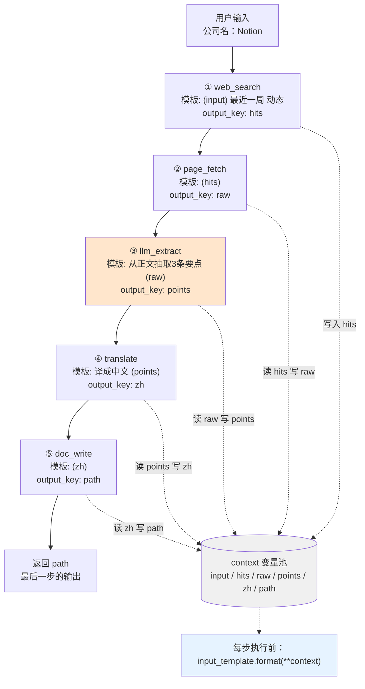

# 第七章 · 构建你的智能体框架 —— 习题解答

> **答题基准**：本解答基于本仓库 `hello_agents/` 里**实际能跑的代码**，不是书本代码的复述。
>
> 两者有几处关键差异，凡涉及的题目我都会用 **⚠️ 与书本不一致** 单独标出 ——
> 因为照着书本记忆去用这个仓库，会踩空。
>
> 所有带 📊 的数据都是我在本机（Python 3.14.4 / pydantic 2.13.4 / openai 2.54.0）**跑出来的**，
> 不是"理论上应该"。附录 A 汇总了全部实测数据，附录 B 是差异清单。

---

## 目录

- [第 1 题　为何需要自建 Agent 框架](#q1)
  - [1.1 四个局限性如何拖慢开发效率](#q1-1)
  - [1.2 「万物皆为工具」的优势与边界](#q1-2)
  - [1.3 从零实现 vs 框架化，以及我的设计原则](#q1-3)
- [第 2 题　Message / Config / Agent 三个核心类](#q2)
  - [2.1 Pydantic 带来了什么](#q2-1)
  - [2.2 公开接口 + 抽象方法是什么模式](#q2-2)
  - [2.3 单例模式与配置管理](#q2-3)
- [第 3 题　工具系统](#q3)
  - [3.1 为什么强制统一接口，多返回值怎么办](#q3-1)
  - [3.2 一条真实的三工具链 + 流程图](#q3-2)
  - [3.3 并行执行什么时候有收益](#q3-3)
- [第 4 题　扩展框架：流式 / 多轮管理 / 插件](#q4)
  - [4.1 流式输出](#q4-1)
  - [4.2 多轮对话管理与分支回溯](#q4-2)
  - [4.3 插件系统](#q4-3)
- [附录 A　实测数据汇总](#app-a)
- [附录 B　本仓库与书本代码的差异清单](#app-b)

---

<a id="q1"></a>
# 第 1 题　为何需要自建 Agent 框架

<a id="q1-1"></a>
## 1.1 四个局限性如何拖慢开发效率

书本 7.1.1 节列的四个局限性是：**过度抽象的复杂性**、**快速迭代的不稳定性**、
**黑盒化的实现逻辑**、**依赖关系的复杂性**。

我不想空谈，就用本仓库 `agent-v11` / `agent-v12` 这两版**真实引入过 LangChain / LangGraph** 的经历来逐条对。

### ① 过度抽象的复杂性 —— 抽象本身没错，错在"抽象底下发生了什么"你不知道

**本仓库的经历**：v11 做结构化输出时，官方推荐的"舒适姿势"（`with_structured_output`、
`response_format` 等）在 DeepSeek 服务端上**三种全部翻车**，最后是靠退回手写才解决的。

这件事的启示不是"框架不好"，而是：

> **抽象层把「服务端约束」这件事实屏蔽了。** 报错来自服务端，界面来自框架，
> 你在中间层看不到任何东西，只能靠猜。

**对开发效率的具体影响**：本来 30 分钟能定位的问题（看一眼请求体就知道 `response_format` 没被接受），
变成 3 小时的全链路猜测。而且**抽象越厚，这个时间差越大**。

n8n/LangChain 那类"链式调用机制虽然灵活，但对初学者学习曲线陡峭"的说法，
本质是同一件事：**你要先学会框架的世界观，才能完成一个本来不需要世界观的任务。**

### ② 快速迭代的不稳定性 —— 最贵的不是改代码，是"不知道该信谁"

**本仓库的经历**：v12 撞上一个 400 报错，文案是
`The reasoning_content ... must be passed back`。

这句话字面意思是"某个字段要回传"，看起来像是"包不兼容"。
我差点就去把 `langchain-openai` 换成 `langchain-deepseek` ——
**真因却是我们自己把请求排成了非标准序列（`[system, assistant]` 收尾，缺 user 引导）。**

**对开发效率的具体影响**：版本变动让"报错文案"和"真实原因"之间的距离被拉大。
排查顺序被迫从「看现象 → 定位」变成「先怀疑库 → 再怀疑自己 → 最后才看现象」。
更糟的是，如果这时你正好升级过一个包，你会把大量时间花在一个**根本不是原因的原因**上。

书本说"商业化框架为了抢占市场，API 接口变更频繁"——
我觉得要补一句更狠的：**变更带来的最大成本不是改代码，是摧毁你对系统的可预测性。**

### ③ 黑盒化的实现逻辑 —— 卡住你的不是难，是"改不了"

**本仓库的经历**：v11 用 `create_agent` 一行就跑通了 Agent，很方便。
但接下来想加「检查点 / 人工审批 / 重规划」时发现：

> `create_agent` 内部那张图（`state → model → tools → …`）你**看不见、也改不了**。

于是 v12 只能换成 LangGraph，**把那张图拆开自己画**。

**对开发效率的具体影响**：这是四者中最伤的一条。前三条是"慢"，这条是"**到不了**"。
它把一个「改动 5 行」的需求变成「换一层框架重做一遍」。

> 📌 **判断信号**：当你的需求开始变成"我想改它内部某一步"，而框架只给你入口、
> 不给你中间件 —— 你就要付这笔迁移成本了。**这个信号越早识别越省事。**

### ④ 依赖关系的复杂性 —— 它会以一种你意想不到的方式收税

**本仓库实测的依赖闭包规模** 📊：

| 依赖根 | 直接依赖 | 传递依赖闭包 |
|---|---|---|
| `langchain` 单独 | 22 个 | — |
| `langchain` + `langgraph` | — | **42 个包** |
| `openai`（本框架实际用的传输层） | 20 个 | — |
| `hello-agents`（pip 版） | 14 个 | 28 个包 |

老实说，"42 个包"这个数字本身不算灾难。真正的问题是它**带来了一类新的故障**：

- 依赖冲突会让你在 `pip install` 阶段就卡住；
- 更隐蔽的是，它让**排查的搜索空间变大** —— 出问题时你不确定是自己的代码、
  是框架、是框架的某个传递依赖，还是服务端。上面 ② 那个 400 报错的误判，成本就是从这里来的。

> **一句话总结四条**：①②④ 让你**变慢**，③ 让你**到不了**。
> 而它们共同的根因是同一个 —— **你看不见中间层**。

---

<a id="q1-2"></a>
## 1.2 「万物皆为工具」的优势与边界

HelloAgents 的设计是：**除了 Agent 类本身，一切皆为 Tools**。
Memory、RAG、MCP、评估、RL 全部被抽象成工具。

### 优势：它消除的是"概念债"，不是"代码量"

| 传统框架 | HelloAgents |
|---|---|
| Memory / Retriever / Chain / Tool 各是一套抽象，各有各的学法和生命周期 | 只有一个概念：**工具** |
| 新增能力要学框架的扩展点（这个框架可能是 Memory 插件，那个可能是 Node） | 新增能力 = 写一个 `Tool` |

从本仓库的代码看，这个理念落地得非常彻底 —— `tools/builtin/` 下：

```
search_tool.py      memory_tool.py     rag_tool.py      note_tool.py
calculator.py       terminal_tool.py   protocol_tools.py（MCP/A2A/ANP）
bfcl_evaluation_tool.py   gaia_evaluation_tool.py   llm_judge_tool.py
win_rate_tool.py          rl_training_tool.py
```

**记忆、检索、协议、评测、强化学习 —— 全部是 `Tool` 子类。**
学习者只需要理解一次「工具」这个概念，剩下的都是它的实例。

我在本仓库亲手验证过这个机制的省力程度 📊：

```python
class Demo(Tool):
    def __init__(self):
        super().__init__(name="demo", description="演示", expandable=True)

    @tool_action("demo_echo", "回显")
    def _echo(self, input: str) -> str:
        """回显输入

        Args:
            input: 要回显的文本
        """
        return f"echo:{input}"
```

**只写了这一个方法**，框架自动完成了：

```
✅ 工具 'demo' 已展开为 1 个独立工具
list_tools()  -> ['demo_echo']
参数自动解析  -> [('input', 'string', '要回显的文本', True)]   ← 参数名/类型/说明全从签名+docstring 推出来
OpenAI schema -> {'type': 'function', 'function': {'name': 'demo_echo', ...}}
```

> 参数说明是从 docstring 的 `Args:` 段推出来的。**"写文档"和"定义接口"合并成了一件事** ——
> 这是"万物皆为工具"最实在的红利。

### 局限：统一抽象会「压扁」差异

抽象越统一，能表达的东西越少。这是我实测出来的三处代价：

**局限一：统一接口把「能力差异」压成了同一个形状。**

`Tool.run(parameters: Dict) -> str` 这个签名意味着**所有工具的输入输出都被压成"字典进、字符串出"**。
但真实模块的差异极大：

| 模块 | 真实语义 | 压成 Tool 后 |
|---|---|---|
| Memory | 有状态、会随对话演进、有遗忘曲线 | 一个无状态的 `run()` 调用 |
| RAG | 有索引构建（慢、离线）和检索（快、在线）两个阶段 | 全塞进一次 `run()` |
| MCP | 是**协议**，会动态发现远端能力、有连接生命周期 | 一个静态描述的工具 |

**举例**：MCP 的核心价值是「运行时才知道对端有哪些工具」，
但 `ToolRegistry` 是在**初始化时**一次性注册的，`get_tools_description()` 一次性拼好提示词。
**动态发现这件事在"工具"这个抽象里是没有位置的** —— 你只能把远端工具的全部描述硬编码成一个静态字符串。

**局限二：统一的"字符串出"会丢掉结构。**

`Tool.run` 声明的返回类型是 `str`。搜索工具返回标题、摘要、链接时，只能自己拼成一段文本。
实测 📊：`execute_tool` 其实**不会**强制这个约定（我让工具返回 dict，它原样返回了 dict），
但下游没有任何东西为结构化返回做好准备 —— 链式模板 `"{s1}".format(...)` 会把 dict 变成
`"{'title': 'A', 'url': 'u'}"` 这种 Python repr，直接拼进提示词。

> **结论**：能返回 dict ≠ 能用 dict。**类型注解是"希望"，不是"保证"；
> 而下游没适配的话，这个"希望"毫无意义。**（详见 3.1）

**局限三：统一的"注册表"会掩盖生命周期。**

`global_registry` 是模块级单例，所有工具共享一份。
于是「谁初始化了数据库连接」「谁该负责关闭」这类问题**在抽象里消失了**。
实测过的一个真实后果：实例化 `MemoryTool()` 会在当前目录创建 `memory_data/memory.db` ——
**一个"工具"的构造有副作用，而且没人管它的清理。**

### 那这个理念到底该不该用？

我认为**在教学和中小规模场景下，它是正确的选择**，理由是：

> 它的目标不是"支持最复杂的场景"，而是"让学习者只需要建立**一个**心智模型"。
> 用一个统一抽象换来概念数量的锐减，在**学习阶段**是极划算的交易。

代价则是：当你要做「有状态的长生命周期服务」「动态能力发现」「多模态结果」时，
**你会撞到这个抽象的天花板，那时需要给它加第二层**（比如给 `Tool` 加生命周期钩子、
加 `ToolResult` 结构化返回）。

**不是推翻它，是长出来。** 这个判断我放在 4.3 的插件系统里具体实现。

---

<a id="q1-3"></a>
## 1.3 从零实现 vs 框架化，以及我的设计原则

### 框架化带来的具体改进（可对照本仓库 v1–v4 与 `hello_agents/`）

| # | 维度 | 第四章从零实现 | 本章框架化实现 | 改进性质 |
|---|---|---|---|---|
| 1 | **Agent 契约** | 每个 Agent 各写各的 `run`，签名靠自觉 | `Agent(ABC)` + `@abstractmethod run`，漏了直接实例化报错 | 从**约定**变成**强制** |
| 2 | **消息格式** | 到处是裸 dict（`{"role": ..., "content": ...}`） | 统一 `Message` + `Literal` 角色校验 + `to_dict()` 出口 | 从**散装**变成**标准化** |
| 3 | **工具** | 工具就是几个 `if/elif` 分支或手写函数 | `Tool(ABC)` + `ToolRegistry` + 自动展开 + OpenAI schema 生成 | 从**写死**变成**可插拔** |
| 4 | **模型接入** | `openai` 客户端直接调，换家要改代码 | `HelloAgentsLLM` 多 provider + 自动检测 | 从**绑定**变成**可切换** |
| 5 | **配置** | 常量散落在文件顶部 | `Config` 集中 + `from_env()` | 从**散落**变成**集中** |
| 6 | **范式复用** | 三个范式各写一遍循环和工具调用 | 6 个 Agent 共享父类的历史管理、消息构建 | **消除重复** |

**其中我认为最有价值的两条是 1 和 3：**

- **第 1 条**：抽象基类把"必须实现 run"从口头约定变成**一条运行时检查**。
  实测 📊 `Agent.__abstractmethods__ == frozenset({'run'})` —— 全部强制力就是这一个集合。
  子类忘了实现，`TypeError` 立刻告诉你，而不是等到线上某次调用才炸。

- **第 3 条**：`@tool_action` + 内省把「定义工具」的成本压到极低。
  一个类里写 20 个方法，就自动有 20 个工具、20 份参数说明、20 份 JSON Schema ——
  **全部从签名和 docstring 推出来，一行重复代码都不用写。**

### 如果让我设计框架，我的五条设计原则

按我认为的重要性排序：

**① 错误必须能追溯到"是哪一层"**

本仓库最值钱的一条经验是那个 400 报错（见 1.1 ②）：文案说的是服务端"想要的字段"，
真因却是自己组装的请求形态不对。所以框架里**每一层都要在出错时自报家门** ——
"这是服务端返回的原话" / "这是我们组装请求时的问题"必须能一眼分开。

**② 默认行为要显式，不要靠"没报错"来暗示成功**

实测过一个反例 📊：工具链里调用一个不存在的工具，终端上打的是

```
📝 执行步骤 2/2: 不存在的工具
✅ 步骤 2 完成            ← 绿的
🎉 工具链 't' 执行完成      ← 也绿的
```

返回值却是 `错误：未找到名为 '不存在的工具' 的工具。`

**根因**：`ToolRegistry.execute_tool` 刻意把一切异常翻成字符串返回（这是"错误也是上下文"的好设计），
但链这一层没有识别它，于是**错误伪装成了正常结果往下游传播**。

> **原则**：一个好的错误约定，必须在**每一层**都显式处理，否则上一层的"宽容"会变成下一层的"欺骗"。

**③ 抽象要可穿透（玻璃盒，不是黑盒）**

这是从 LangChain 那四条里学到的。具体到设计上：
**每一个被封装的能力，都要有一条"看到原始请求/响应"的路。**
本仓库的 `--config` 打印配置来源、`📝 审计留痕：tool=crm_query 参数='C-88'`
就是这条原则的小规模落地。

**④ 扩展点要和用户代码用同一个协议**

不要发明两套东西（"用户写工具用 A，写插件用 B"）。
如果 `Tool` 是扩展单位，那么**插件也应该只是在批量注册 `Tool`**，而不是另起一套 API。

**⑤ 能从签名推出来的，绝不让人写第二遍**

`@tool_action` 的自动参数解析就是这条的样板。
但要注意它的**反噬**：三样东西（签名、类型注解、docstring）都是"尽力而为、静默降级"，
注解没写就当 `str`，docstring 没写 `Args:` 就退化成"参数 xxx"，**全程不报错**。

> **修正版**：静默降级可以保留（保证能跑），但**必须有一条"体检"通道**把降级暴露出来 ——
> 比如 `registry.describe()` 直接打印"这个工具的参数说明是自动兜底的，可能不准"。

---

<a id="q2"></a>
# 第 2 题　Message / Config / Agent 三个核心类

> ⚠️ 先声明：本仓库的 `Config` **不是**单例，`Agent` **没有** `_execute` 方法。
> 详见 2.2 / 2.3，附录 B 有完整差异清单。

<a id="q2-1"></a>
## 2.1 Pydantic 带来了什么

`Message` 继承 `pydantic.BaseModel`，我实测了它的四条收益和两条代价。

### 收益

**① 类型校验在「构造那一刻」发生，而不是「用的时候」**

📊 实测：

```python
Message("hi", "boss")     # role 不在 Literal 里
  → pydantic ValidationError: 1 validation error for Message
     role: Input should be 'user', 'assistant', 'system' or 'tool'

Message(123, "user")      # content 传了 int
  → ValidationError: content: Input should be a valid string

m.content = 999           # 构造之后再赋值
  → ValidationError（赋值也会校验）
```

**这对开发效率的意义**：一个角色名写错，如果在 20 分钟后才因为某次 API 调用失败而暴露，
你要回溯 20 分钟。**校验越靠前，定位成本越低** —— 最好的是"写错的下一行就报"。

**② `Literal` 在 Pydantic 字段上会真的执行**

这是一个容易被忽略的细节，本仓库 `message.py` 的注释里专门标了：

| 写在哪 | 运行时会校验吗 |
|---|---|
| 函数参数注解（如 `llm.py` 的 `provider`） | ❌ 只给 mypy 看，写错字符串照样跑 |
| **Pydantic 模型字段**（如 `Message.role`） | ✅ **真的校验** |

> **同一个 `Literal`，位置不同，效果完全不同。** 这是"类型注解只是给工具看的"
> 这个常识的一个例外。

**③ 白拿 `__repr__`、比较、序列化**

不用写 `__init__` / `__repr__` / `__eq__`，`print(msg)` 直接可读。

**④ 字段声明即文档**

```python
content: str
role: MessageRole
timestamp: datetime = None
metadata: Optional[Dict[str, Any]] = None
```

四行就是完整的接口说明 —— 类型、是否可空、默认值全在。

### 代价（这两条必须一起讲，否则不诚实）

**① 校验是有成本的，而且在高频路径上不可忽略。**

每构造一条消息都要走一遍 pydantic 校验。对于"对话历史"这种每次请求都要重建几十条的路径，
这是实打实的开销。**好消息是它换来了正确性，坏消息是它不能白拿。**

**② 它和"轻量级、教学友好"这个目标有张力。**

本仓库的 `Message` 类只有 4 个字段，却要引入 `pydantic`（它自己又依赖 `pydantic-core`，是个 Rust 扩展）。
一个 40 行的数据类，换来了一个编译型依赖 —— **这个交易在教学场景划算（因为 pydantic 是行业标配，
迟早要学），在极简场景未必**。

### 一个"工具本身在撒谎"的实例

本仓库里有一处很值得学的细节 —— `Message.timestamp` 的声明：

```python
timestamp: datetime = None     # 注解说是 datetime，默认值却给了 None
```

而实测 📊 `Message("你好", "user").timestamp` 的类型是 **`datetime`** ——
因为被覆盖的 `__init__` 总是会传入 `datetime.now()`，那个 `None` 默认值**从来没被用上**。

> **教学价值**：这演示了"Pydantic 默认不校验默认值"这个特性 ——
> 类型注解和默认值可以互相矛盾而**不报任何错**。要发现它只有两个办法：
> 读代码，或者写一个断言去测。

---

<a id="q2-2"></a>
## 2.2 公开接口 + 抽象方法是什么模式

### 书本的描述

书本 7.3.3 的 `Agent` 基类只定义了 `@abstractmethod run`。
习题里说的「`run` 是公开接口、`_execute` 是抽象方法」在本仓库里**对不上**：

📊 实测：

```python
Agent.__abstractmethods__            = frozenset({'run'})
Agent 里以 _ 开头的方法               = ['__init__', '__repr__', '__str__']
```

**本仓库的实际情况是**：`run` 既是公开接口、又是唯一的抽象方法；
具体的执行逻辑下沉到各子类的**私有方法**里，例如 `SimpleAgent` 的
`_parse_tool_calls` / `_execute_tool_call` / `_build_messages`。

这其实是一个**更经典的组合**。我按它实际的样子回答。

### 模式名称

这个模式有几个名字，取决于从哪个角度看：

| 名字 | 强调什么 | 在这里怎么体现 |
|---|---|---|
| **模板方法模式**（Template Method） | 父类定骨架，子类填步骤 | 父类定"必须有 run"，子类填 |
| **抽象基类 / 接口契约**（ABC / Interface） | 强制一组实现 | `ABC` + `@abstractmethod` |
| **公开接口 + 私有实现**（Public API / Private Impl） | 调用方的稳定面 vs 内部的自由面 | `run()` 公开，`_execute_tool_call()` 私有 |
| **好莱坞原则**（"别找我们，我们会找你"） | 控制权反转 | 框架调你的 `run`，你不调框架 |

**我会答"模板方法模式 + 抽象基类契约"**，因为这道题的重点在"为什么要分成两层"。

### 好处

**① 调用方只依赖一个稳定面。**

任何 Agent 都能被这样使用：

```python
for agent in [simple, react, reflection, plan_solve]:
    print(agent.run("..."))          # 同一个签名，四种范式
```

**四种完全不同的内部机制，对外是一个方法。** 这就是多态的实际价值 ——
`PlanAndSolveAgent` 内部有个 Planner/Executor 组合，`ReActAgent` 内部有个
Thought/Action/Observation 循环，但对调用方来说**没有任何区别**。

**② 私有方法给了子类"自由重写的空间"，且不破坏契约。**

本仓库最漂亮的一处例子是 `ToolAwareSimpleAgent`：

```python
class ToolAwareSimpleAgent(SimpleAgent):
    def _execute_tool_call(self, tool_name, parameters):   # 重写私有方法
        result = super()._execute_tool_call(...)           # 照抄父类流程
        self._notify_listeners(...)                        # 只在"执行完"多一步
        return result
```

它只重写了一个**私有方法**，就实现了"每次工具调用都留痕"，
而 `run()` 的签名和行为完全不变。

> **关键设计点**：`_execute_tool_call` 这个"钩子"是被**有意留出来**的。
> 判断一个基类设计得好不好，就看**子类扩展时需不需要复制 `run()` 的代码** ——
> 如果需要，说明钩子的粒度切错了。

**③ 强制约束把错误提前到"实例化那一刻"。**

```python
# 忘实现 run 的子类
class HalfBaked(Agent): pass
HalfBaked(name="x", llm=llm)
  → TypeError: Can't instantiate abstract class HalfBaked without an implementation for abstract method 'run'
```

📊 而且这个强制力的机制很简单 —— 我把 `Agent.__abstractmethods__` 清空之后，
实例立刻就能造出来。**全部强制力就是那一个 `frozenset`，没有任何隐藏机制。**

### 这个模式的反面：约束太强也会碍事

`run(self, input_text: str, **kwargs) -> str` 这个签名强行规定：
**输入是字符串、输出是字符串**。

但本仓库实测过两个"不合身"的地方 📊：

1. **`SimpleAgent.stream_run` 返回的是生成器**，不是 `str` —— 同族方法返回类型不一致，
   而抽象基类对此**无能为力**（Python 的 ABC 只检查"有没有这个方法"，不检查签名和返回类型）。
2. **`FunctionCallAgent.stream_run` 名不副实**：

```python
def stream_run(self, input_text: str, **kwargs) -> Iterator[str]:
    """流式调用暂未实现，直接回退到一次性调用"""
    result = self.run(input_text, **kwargs)
    yield result                      # ← 只有 1 片，而且是在跑完之后
```

> **教训**：`hasattr(obj, 'stream_run')` 为真 **≠** 真的支持流式。
> **抽象基类保证的是"名字存在"，不是"语义正确"。**
> 要保证语义，只能在基类里给一个**会抛 NotImplementedError 的默认实现**，
> 而不是允许子类留一个"看起来对、实际是退化版"的实现。这一条我在 4.1 里改。

---

<a id="q2-3"></a>
## 2.3 单例模式与配置管理

### ⚠️ 首先必须纠正：本仓库的 `Config` 不是单例

书本 7.3.2 贴出的 `Config` 代码就是一个普通的 `BaseModel`，**没有任何单例实现**。
习题里"我们使用了单例模式"这个前提在本仓库里不成立。📊 实测：

```python
Config() is Config()          → False       # ← 每次都是新对象
a = Config(temperature=0.1)
b = Config()
b.temperature                 → 0.7         # ← a 的修改完全不影响 b
```

而且 `Agent.__init__` 里写的是 `self.config = config or Config()`，
意味着**每个 Agent 各持有一份独立的 Config** —— 三个 Agent 就有三份。

**所以这道题我分两部分答**：先讲清单例模式本身（这是题目要考的），
再讲"本仓库实际上怎么做的、这样做有什么问题"。

### 什么是单例模式

**定义**：保证一个类**只有一个实例**，并提供一个全局访问点。

Python 里最简洁的实现是覆盖 `__new__`：

```python
class Config(BaseModel):
    _instance = None

    def __new__(cls, *args, **kwargs):
        if cls._instance is None:
            cls._instance = super().__new__(cls)
        return cls._instance
```

（更 Pythonic 的做法是用模块级变量 —— 因为**模块本身就是天然的单例**：
`sys.modules` 会缓存它，模块体只执行一次。本仓库的 `global_registry = ToolRegistry()`
用的就是这种"模块级单例"。）

### 为什么配置管理需要它

**理由一：配置是"全局环境事实"，不是"某个对象的状态"。**

`LLM_API_KEY`、`log_level`、`temperature` 这些东西描述的是
**"这个进程跑在什么环境里"**，而不是"某个 Agent 是什么样"。

**理由二：避免"配置漂移"。**

这是不用单例最直接、也最现实的问题：

```python
a = Config()
a.log_level = "DEBUG"          # 某个模块临时打开调试

b = Config()                    # 另一个模块自己造了一份
print(b.log_level)              # → "INFO"    ← 它没看到你的修改
```

同一份"配置"在内存里存在了多份互相矛盾的副本。**这类 bug 最难查，因为每个副本单独看都是对的。**

**理由三：改一处要能全局生效。**

想让 `max_history_length` 从 100 变成 50，你希望改一个地方。
如果每个 Agent 各持一份，你得改 N 个地方 —— 而且**未来新增的 Agent 会漏掉**。

### 不用单例会导致什么（本仓库的三个真实后果）

**后果一：配置改了不生效 —— 实测发现 `max_history_length` 是个"死字段"**

📊 全仓库 grep `max_history_length`，只有一处：

```
hello_agents/core/config.py:35:    max_history_length: int = 100
```

**声明了，但没有任何代码读它。** 也就是说 `Agent._history` 是**无上限增长**的 ——
配置里那个 100 完全没有约束力。

> **这是"配置散落"最典型的病灶**：字段存在、默认值合理、文档看起来没问题，
> 但**它和真实的执行路径之间没有任何连线**，而且没有任何机制能发现这件事。

**后果二：`Config.from_env()` 从来没被调用过**

📊 同样 grep：`from_env` 在 `config.py` 里定义，**零个调用点**。
这意味着即使你在 `.env` 里设了 `TEMPERATURE=0.1`，它也**不会生效** ——
因为没人调用那个方法。

> **这条最值得记住**：框架里最危险的代码不是"错的代码"，是**"看起来对、但从来没被执行的代码"**。
> `from_env()` 写得完全正确，注释齐全，就在那儿等着你以为它在工作。

**后果三：没有单一真相源 → 无法审计"这次跑用的是哪套配置"**

本仓库自己在 `agent-vN` 系列里做了 `--config` 命令打印配置来源，
说明作者已经意识到这个问题 —— 但在 `hello_agents/` 这个框架里，
`Config` 是没有这个能力的。

### 那正确的设计是什么

我认为答案不是"无脑上单例"，而是这三条：

1. **只读单例 + 显式注入**：`Config` 提供 `Config.instance()`，但 `Agent` 接受
   `config` 参数覆盖它（本仓库的 `config or Config()` 在做这件事，
   只是"默认那份"不是共享的）。**全局默认 + 局部可覆盖**，兼顾可控和可测。

2. **配置必须有"生效证明"**：`--config` 那类命令要做成框架的一部分，
   而不是每个示例自己写。**没被读到的字段要能被发现。**

3. **不可变优先**：配置一旦构造就冻结（Pydantic 的 `model_config = ConfigDict(frozen=True)`）。
   这样"改了一处不生效"的问题会变成"改的时候直接报错" —— **把静默失败变成显式失败**。

> 第 3 条尤其重要，因为后果一/二都是**静默失败**。
> 单例解决的是"多份副本"的问题，但**不解决"字段没被读"的问题** ——
> 后者只能靠"冻结 + 审计"来治。

---

<a id="q3"></a>
# 第 3 题　工具系统

> ⚠️ 本仓库的基类叫 **`Tool`**（不是 `BaseTool`），抽象方法叫 **`run`**（不是 `execute`），
> 而且有**两个**抽象方法：`run` 和 `get_parameters`。📊 实测 `Tool.__abstractmethods__ == frozenset({'run', 'get_parameters'})`。

<a id="q3-1"></a>
## 3.1 为什么强制统一接口，多返回值怎么办

### 为什么要强制

**① 调用方需要一个"不用判断类型"的入口。**

`ToolRegistry.execute_tool` 的全部实现就是：

```python
if name in self._tools:
    return tool.run({"input": input_text})
```

**它不需要知道这是搜索工具还是计算工具。** 这就是统一接口的全部价值 ——
让调度方从"我要处理 N 种工具"变成"我要处理一种东西"。

**② 这是"自动发现"能成立的前提。**

`Tool.get_parameters()` 让每个工具能**自描述**。有了它，框架才能自动生成：

| 出口 | 用途 |
|---|---|
| `get_tools_description()` | 拼成提示词里的纯文本工具清单 |
| `to_openai_schema()` | 转成 OpenAI function calling 的 JSON Schema |

**没有 `get_parameters` 这个契约，这两个都得靠人手动维护 —— 而手动维护的 schema 一定会和代码不一致。**

**③ 强制约束把错误从"运行时"提前到"实例化时"。**

```python
class MyTool(Tool):
    def run(self, parameters): return "ok"
    # 忘了实现 get_parameters

MyTool(name="x", description="y")
  → TypeError: Can't instantiate abstract class MyTool without an implementation
              for abstract method 'get_parameters'
```

**④ 不强制会怎样？** 最坏的情况不是"报错"，是"**静默地不工作**"。
本仓库实测过这类真实缺陷 📊：

> 用 `register_function` 注册的函数式工具，会被 `get_tools_description()`
> **正常列进提示词**（模型被告知有这么一个工具），
> 但 `SimpleAgent._execute_tool_call` 只查 `Tool` 对象、查不到它 ——
> 于是模型兴冲冲地调用它，得到的回答是"未找到工具"。

**这就是不统一接口的直接代价**：系统里存在两种"工具"，
一边承认它们、一边不承认它们，**而且没有任何地方会报错。**

### 多返回值应该怎么设计

题目给的场景很具体：**搜索工具要返回标题、摘要、链接**。

这三种设计我按推荐度排序，并且都实测了在当前框架下的表现。

#### 方案 A（当前 de-facto）：格式化成一段文本

本仓库的 `SearchTool` 就是这么做的：

```
🎯 Tavily AI搜索结果: <直接答案>

[1] 标题
    摘要前 200 字...
    来源: https://...
```

**优点**：立刻能用，直接拼进提示词，不需要改任何东西。
**缺点**：
- 结构信息在拼字符串那一刻就丢了 —— 下游想"只取第 3 条的链接"必须再做一次文本解析（**用正则解析自己刚格式化的文本，是很典型的反模式**）。
- 格式是隐式契约，改一次格式就可能悄悄破坏所有下游。

#### 方案 B：返回 JSON 字符串

```python
def run(self, parameters):
    return json.dumps({"results": [{"title": ..., "snippet": ..., "url": ...}]}, ensure_ascii=False)
```

📊 实测：`execute_tool` **会原样把返回值传出去**（我让工具返回 dict，拿到就是 dict），
所以返回 JSON 字符串在**当前框架里是可行的**。

**优点**：结构保住了，且仍是字符串，符合契约。
**缺点**：**下游要自己 `json.loads`** —— 而框架没有任何地方约定"有些工具的返回值是 JSON"。
提示词里会直接塞进一大坨 JSON，可读性对模型不友好。

#### 方案 C（我推荐的）：显式的 `ToolResult` + 在 Agent 边界做转换

核心思路是**承认"结构化结果"是一等公民**，把它显式建模出来，而不是塞进字符串。

```python
class ToolResult(BaseModel):
    content: str                      # 给模型看的自然语言（必填）
    data: Dict[str, Any] = {}         # 给代码用的结构化数据
    artifacts: List[str] = []         # 副作用产物（文件路径等）

class Tool(ABC):
    @abstractmethod
    def run(self, parameters: Dict[str, Any]) -> ToolResult: ...
```

然后在**唯一的边界**上（`registry.execute_tool`）决定怎么给模型：

```python
def execute_tool(self, name, input_text) -> str:
    result = self._tools[name].run({"input": input_text})
    # 边界处：给模型的是 content；data 留给需要它的下游（链、评测、UI）
    self._last_result = result
    return result.content
```

**为什么推荐这个**：

1. **`content` 面向模型，`data` 面向代码** —— 两者的需求本来就不同，
   强行压成一个字符串才是问题的根源。
2. **向后兼容**：`execute_tool` 仍然返回 `str`，现有的 `SimpleAgent`、
   `FunctionCallAgent` 一行都不用改。
3. **它给 3.2 的链式和 4.3 的插件留了口子** —— 链可以传递 `data`，
   插件可以在边界处拦截 `ToolResult`（比如做审计、做缓存）。

📊 **反证：不做这一步会怎样。** 我实测让工具返回 dict，
然后把它喂给链式模板：

```python
context["s1"] = {"title": "A", "url": "u"}
"结果: {s1}".format(**context)
  → "结果: {'title': 'A', 'url': 'u'}"
```

**一坨 Python repr 直接进了提示词，而且是单引号的** ——
模型看到的是 `{'title': 'A'}` 而不是 JSON，既难解析也可能误导。
**这正说明"结构化数据"在当前的"字符串出"契约下没有任何位置。**

---

<a id="q3-2"></a>
## 3.2 一条真实的三工具链 + 流程图

### 先说一个必须避开的坑

本仓库自带的 `create_research_chain` 是个**反例**，值得先看：

```python
chain.add_step(tool_name="search",        input_template="{input}",   output_key="search_result")
chain.add_step(tool_name="my_calculator", input_template="2 + 2",     output_key="calc_result")
                                                            ↑ 写死的常量
```

它的 docstring 写着"基于搜索结果进行计算"，
但第二步的模板是**硬编码的 `"2 + 2"`** —— **第一步辛苦搜出来的 `search_result` 压根没被用到。**

> **判断一条链是不是真的链，只看一件事：后一步的模板里有没有前一步的 `output_key`。**
> 没有，它就只是"把几个不相关的调用排了个序"。

（另外它的工具名 `my_calculator` 也是错的：`CalculatorTool` 实测注册名是 `python_calculator`。）

### 我设计的场景：竞品周报自动生成

**业务背景**：每周一给团队发一份"竞品动态简报"。原始流程是人工做 4 件事，
耗时约 40 分钟。

| 步骤 | 工具 | 做什么 | 输入来自 |
|---|---|---|---|
| ① | `web_search` | 搜"XX 公司 最近一周 动态" | 用户输入的公司名 |
| ② | `page_fetch` | 抓取搜索结果的正文（**取第 1 条**） | ① 的结果 |
| ③ | `llm_extract` | 从正文里抽出结构化的 3 条要点 | ② 的结果 |
| ④ | `translate` | 英文要点译成中文 | ③ 的结果 |
| ⑤ | `doc_write` | 追加写入 `周报.md` | ④ 的结果 |

**为什么这个场景适合工具链（而不是 ReAct）**：

> 步骤顺序**事先完全确定**，不依赖中间结果做决策。
> 只要满足这一点，工具链就比让模型临场决策更**便宜、更快、更可预测**。
> 反过来，如果第 ③ 步需要"看第 ② 步抓到了什么再决定下一步干嘛"，就该换 ReAct 范式。

### 执行流程图



**数据流对照表**（这是"它是不是真链"的证据）：

| 步骤 | 模板占位符 | 由哪一步写入 context |
|---|---|---|
| ① | `{input}` | `execute()` 开头手工写入 |
| ② | `{hits}` | ① 的 `output_key="hits"` |
| ③ | `{raw}` | ② 的 `output_key="raw"` |
| ④ | `{points}` | ③ 的 `output_key="points"` |
| ⑤ | `{zh}` | ④ 的 `output_key="zh"` |

**每一步都引用了上一步的 `output_key`，这才叫链。**

### 用真实代码写出来

```python
def create_weekly_brief_chain() -> ToolChain:
    chain = ToolChain(
        name="weekly_competitor_brief",
        description="竞品周报：搜索 → 抓正文 → 抽取要点 → 翻译 → 落盘",
    )

    # ① 搜索：模板引用初始输入
    chain.add_step("web_search", "{input} 最近一周 动态", "hits")

    # ② 抓正文：只依赖上一步
    chain.add_step("page_fetch", "{hits}", "raw")

    # ③ 抽要点：真实的变量传递发生在这里
    chain.add_step(
        "llm_extract",
        "请从下面的网页正文中抽取 3 条最重要的动态，每条一行：\n{raw}",
        "points",
    )

    # ④ 翻译
    chain.add_step("translate", "把下面的内容译成中文，保留要点结构：\n{points}", "zh")

    # ⑤ 落盘：最后一步的输出就是整条链的返回值
    chain.add_step("doc_write", "{zh}", "path")

    return chain
```

### 上生产前必须处理的三件事（都是本仓库实测出来的）

**① `format` 的失败模式比捕获的多。**

当前实现只捕获 `KeyError`，实测 📊：

| 模板 | 抛什么 | 现有代码接得住吗 |
|---|---|---|
| `"{nope}"` | `KeyError` | ✅ 接住 |
| `'{"a": 1}'`（JSON 字面量） | `KeyError: '"a"'` | ✅ 接住（但是误判） |
| `"{}"` | **`IndexError`** | ❌ **直接炸穿** |

> **修法**：捕获 `(KeyError, IndexError, ValueError)`，
> 并且**在 `add_step` 时就预检模板**（用正则扫出所有占位符，立刻比对已知的 output_key 集合）。
> 把错误从"运行时"提前到"定义时"。

**② 错误字符串会被当成正常数据往下游传。**

📊 实测：故意把第 2 步设成不存在的工具，输出是

```
📝 执行步骤 2/2: 不存在的工具
✅ 步骤 2 完成              ← 绿的
🎉 工具链 't' 执行完成        ← 也是绿的
返回值：错误：未找到名为 '不存在的工具' 的工具。
```

**根因链条**：
`registry.execute_tool` 从不抛异常（它刻意把错误翻成字符串，这是好设计）
→ 链这一层拿到的是个正常字符串
→ 写进 `context["step_1_result"]`
→ **下一步的模板把它当数据插进去**
→ 错误安静地流向结尾，全程绿灯。

> **修法**：`ToolResult`（见 3.1 方案 C）就是为这个准备的 ——
> 给结果加一个 `ok: bool` 字段，链在每一步之后检查它，
> **该中断就中断，并且日志要说明白"因为第 N 步失败而中止"**。

**③ 长链没有断点，中间结果全丢。**

第 ③ 步失败了，前两步的搜索结果和抓取的正文**全部丢掉，要重跑**。
对于"搜索 + 抓取"这种有成本、有速率限制的步骤，这是很浪费的。

> **修法**：`context` 本身就是天然的检查点 ——
> 把它序列化落盘（`chain.execute(..., checkpoint="run.json")`），
> 失败后可以从任意一步恢复。这也正好是 LangGraph 的 checkpointer 在做的事。

---

<a id="q3-3"></a>
## 3.3 并行执行什么时候有收益

### 结论先行

> **并行只对"等待型"任务有收益；对"计算型"任务，线程池在 CPython 上几乎不带来任何提升。**

这不是理论，是本机实测的结果。

### 📊 实测数据

**实验一：线程池到底有没有用？**（4 个任务，`max_workers=4`）

| 任务类型 | 串行 | 4 线程池 | 加速比 |
|---|---|---|---|
| **I/O 型**（各 `time.sleep(0.3)`） | 1.21 s | **0.30 s** | **4.00x** |
| **CPU 型**（各算 300 万次平方和） | 1.29 s | **1.30 s** | **1.00x** |

**实验二：本仓库的 `execute_tools_parallel` 到底并行了吗？**

| 实现方式 | 4 × 0.3s 任务的耗时 |
|---|---|
| `AsyncToolExecutor.execute_tools_parallel`（现状） | **1.21 s** ← 串行 |
| 换成 `asyncio.gather` | **0.30 s** ← 真并行 |

### 为什么 I/O 有收益、CPU 没有：GIL

CPython 有 **GIL（全局解释器锁）**：同一时刻只有一个线程在执行 Python 字节码。

关键在于**线程在什么时候会释放 GIL**：

| 任务在做什么 | 会释放 GIL 吗 | 结果 |
|---|---|---|
| 等网络 / 等磁盘 / 等数据库 / `sleep` | ✅ **等待时会释放** | 别的线程能跑 → **真并行** |
| 纯 Python 计算（循环、解析、加密） | ❌ **全程攥着** | 只是轮流跑 → **没有加速** |

**这就解释了上面的数据**：CPU 型任务的加速比精确地是 **1.00x** ——
线程池开了 4 个线程，但它们在抢同一把锁，总时间一点没少。

### 因此"什么时候并行有收益"的具体判据

**✅ 有收益（值得并行）**

1. **多个独立的、等待外部服务的工具调用。**
   比如"同时搜 5 个竞品"—— 每个调用的时间几乎全花在网络等待上。
2. **单个工具内部本来就是 I/O 密集**，且任务之间无依赖。
3. **批量处理同一工具**（`execute_tools_batch` 的设计初衷）。

**❌ 没有收益（不必并行）**

1. **CPU 密集的工具**（大量计算、加解密、图片处理）。
   → 要真提速得用 `ProcessPoolExecutor`（多进程，各有一把 GIL），
   代价是进程间通信和序列化开销。
2. **任务之间有顺序依赖**（前一步的输出是后一步的输入）——
   这类场景该用链（3.2）或 ReAct，**并行是错的工具**。
3. **任务数量少于实际耗时**（比如 4 个任务每个 5ms）——
   线程池的创建和调度开销可能比省下的时间还多。

### 还有三个必须知道的现实约束

**① `max_workers` 是"并发度上限"，不是"任务数"。**
默认 4 意味着同一时刻最多 4 个在跑，第 5 个排队。设置过大反而会因线程切换而变慢。

**② 线程数是有限资源，且不受控的并发会打爆下游。**
如果工具是调外部 API，4 个并发和 100 个并发对服务端的压力完全不同 ——
**并行度必须是一个显式可配的旋钮，而不是"越多越好"。**

**③ 本仓库的 `AsyncToolExecutor` 目前整个是坏的。**
📊 实测：

```
async with AsyncToolExecutor(registry, max_workers) as executor:
  → TypeError: 'AsyncToolExecutor' object does not support the asynchronous context
     manager protocol (missed __aexit__ method) but it supports the context manager protocol.
     Did you mean to use 'with'?
```

原因是类只定义了同步的 `__enter__` / `__exit__`，
而 `async with` 找的是 `__aenter__` / `__aexit__`（**多一个 a**）。

**连带报废**：`run_parallel_tools`、`run_batch_tool`、`run_parallel_tools_sync`、
`run_batch_tool_sync` 四个便捷函数全部一调就炸，
连文件末尾自带的 `python -m hello_agents.tools.async_executor` 演示都跑不起来。

> **但要注意**：以上三个约束都**不影响结论**。并行的收益边界由 GIL 决定，
> 和这个类写没写好无关。反过来说 ——
> **这也说明"写了个异步执行器"和"异步执行器真能提速"是两件事**，
> 判断能力必须落在**实测的加速比**上，而不是 `hasattr(obj, 'execute_tools_parallel')`。

---

<a id="q4"></a>
# 第 4 题　扩展框架：流式 / 多轮管理 / 插件

<a id="q4-1"></a>
## 4.1 流式输出

### 现状盘点：框架已经有一半了

好消息是，本仓库的**底层流式已经跑通**，缺的是"把流式提升为一等公民"。

| 层 | 现状 | 文件 |
|---|---|---|
| LLM 层 | ✅ `think()` 是生成器；`stream_invoke()` 逐块转发 | `core/llm.py` |
| SimpleAgent | ✅ **真流式**：📊 回复 2 个字符就 yield 2 片 | `agents/simple_agent.py` |
| FunctionCallAgent | ❌ **假流式**：`result = self.run(...); yield result`，只有 1 片 | `agents/function_call_agent.py` |
| ReAct / Reflection / PlanAndSolve | ❌ **完全没有 `stream_run`** | `agents/*.py` |

📊 `SimpleAgent.stream_run` 的核心（**这就是正确的样板**）：

```python
for chunk in self.llm.stream_invoke(messages, **kwargs):
    full_response += chunk
    yield chunk                     # 逐片转交给调用方

self.add_message(Message(input_text, "user"))
self.add_message(Message(full_response, "assistant"))   # 收完才写历史
```

**两个值得注意的设计**：
1. **对外是碎片，对内是完整记录** —— 累加 `full_response` 就是为了收完后存历史。
2. **历史在流结束后才写** —— 中途断了就不会留下半条消息。

### 问题：现在的流式只能传"文本"

`Iterator[str]` 这个签名**无法表达**下面这些必须发生的事：

- "正在调用工具 `web_search`"（**这才是 Agent 流式最有价值的部分**）
- "工具返回了，现在继续生成"
- "发生错误了"
- "结束了，这是完整结果"

用纯文本流的话，你只能把这些硬塞进字符串里（比如 `"[TOOL_CALL:...]"`），
前端得**再解析一遍文本**才知道发生了什么 —— 这和我们反对的"格式化成文本"是同一个错误。

### 方案：把流式提升为**事件流**

#### 新增类：`StreamEvent`

```python
# hello_agents/core/stream.py

class StreamEventType(str, Enum):
    TEXT_DELTA     = "text_delta"       # 文本增量（打字机效果）
    TOOL_CALL      = "tool_call"        # 准备调用某工具
    TOOL_RESULT    = "tool_result"      # 工具返回
    STEP_START     = "step_start"       # 多步范式的一步开始（ReAct/Plan）
    STEP_END       = "step_end"
    ERROR          = "error"
    DONE           = "done"             # 终结事件，带完整结果

class StreamEvent(BaseModel):
    type: StreamEventType
    data: Dict[str, Any] = {}
    # 便捷属性
    @property
    def text(self) -> str:
        return self.data.get("text", "")
```

#### 抽象基类：给 `stream_run` 一个"诚实"的默认实现

**这是 2.2 里提到的那个修正** —— 不给子类留"退化版实现"的空间：

```python
class Agent(ABC):
    @abstractmethod
    def run(self, input_text: str, **kwargs) -> str: ...

    def stream_run(self, input_text: str, **kwargs) -> Iterator[StreamEvent]:
        """默认实现：明确声明「本范式不支持流式」，而不是假装支持。"""
        raise NotImplementedError(
            f"{type(self).__name__} 尚未实现流式输出。"
            f"请改用 run()，或为该 Agent 实现 stream_run()。"
        )
```

> **对比现状**：`FunctionCallAgent.stream_run` 现在的写法是
> "先跑完 `run()`，再一次性 yield 结果" —— 它**不会报错**，
> 只是让你以为有打字机效果，实际是一片一片地吐一个大字符串。
> **一个明确抛出的 `NotImplementedError`，比一个假装工作的实现有价值得多。**

#### 需要修改的类和方法

| 层 | 改动 | 改动量 |
|---|---|---|
| `core/stream.py` | **新增**：`StreamEvent` / `StreamEventType` | 新文件 |
| `core/llm.py` | `ThinkStream` 增加 `tool_call_delta` 事件（原生 function calling 的流式分片） | 中 |
| `core/agent.py` | 新增 `stream_run` 默认实现（抛 `NotImplementedError`） | 极小 |
| `agents/simple_agent.py` | `stream_run` 改为 yield `StreamEvent`；工具调用前后各发一个事件 | 小 |
| `agents/function_call_agent.py` | **真流式**：用 `llm` 的流式 + `tool_calls` 分片累积 | **大** |
| `agents/react_agent.py` | 每个 Thought/Action/Observation 发 `STEP_START/END` | 中 |
| `agents/reflection_agent.py` | 每轮"反思"发一个 `STEP_START/END` | 中 |
| `agents/plan_solve_agent.py` | Planner 出计划后发事件；Executor 每步一个事件 | 中 |

#### 保持向后兼容：加一个 `text_stream()`

`Iterator[str]` 的旧接口不要删 —— 它够简单，多数场景够用：

```python
def text_stream(self, input_text, **kwargs) -> Iterator[str]:
    for ev in self.stream_run(input_text, **kwargs):
        if ev.type == StreamEventType.TEXT_DELTA:
            yield ev.text
```

**这样两种消费者都能用**：CLI 用 `text_stream` 就够了；
Web UI 用 `stream_run` 才能显示"🔧 正在搜索…"这类状态。

#### 用起来长什么样

```python
for ev in agent.stream_run("帮我查一下 Notion 的最新动态"):
    if ev.type == StreamEventType.TEXT_DELTA:
        print(ev.text, end="", flush=True)            # 打字机
    elif ev.type == StreamEventType.TOOL_CALL:
        print(f"\n🔧 调用 {ev.data['name']}({ev.data['args']})")
    elif ev.type == StreamEventType.TOOL_RESULT:
        print(f"   ↳ {ev.data['result'][:80]}")
    elif ev.type == StreamEventType.DONE:
        print(f"\n✅ 完成，共 {ev.data['total_chars']} 字")
```

#### 三个必须处理的工程细节

1. **历史写入时机**：只能在 `DONE` 时写。中途 `GeneratorExit`（客户端断开）
   要捕获并把已生成的部分**按配置决定**存或不存。
2. **异常要变成事件**：`ERROR` 事件之后必须跟一个 `DONE`，
   **否则消费者会永远等下去**。
3. **背压**：如果消费端很慢，生产者可能堆积。简单做法是让 `yield` 天然阻塞
   （生成器本身就是拉模型，天然有背压）；复杂做法是加缓冲。
   **教学框架用前者就够。**

---

<a id="q4-2"></a>
## 4.2 多轮对话管理与分支回溯

### 现状：一个扁平列表，没有任何结构

📊 本仓库的现状非常"薄"：

```python
class Agent(ABC):
    def __init__(...):
        self._history: list[Message] = []      # 扁平列表，无 id、无父指针

    def add_message(self, message: Message): self._history.append(message)
    def clear_history(self):                 self._history.clear()
    def get_history(self) -> list[Message]:  return self._history.copy()
```

而 `Message` 只有 4 个字段：

```python
content: str
role: MessageRole
timestamp: datetime = None
metadata: Optional[Dict[str, Any]] = None
```

📊 grep 全仓库：**没有 `parent_id`、没有 `branch`、没有 `checkpoint` 相关的任何代码。**

**所以"分支和回溯"在当前设计下是做不到的** —— 不是"难"，是**没有地方存放这个信息**。
`_history` 是一个只能追加的数组，一旦 `clear_history()` 就永久丢失。

### 设计目标

| 能力 | 含义 |
|---|---|
| **自动管理** | 超过上限时自动压缩/裁剪（无需调用方介入） |
| **分支** | 从任意一条历史消息出发，尝试不同的后续（"如果当时那样答会怎样"） |
| **回溯** | 把对话指针移回过去某一点，从那里继续 |
| **持久化** | 关掉进程再打开，整棵树（含分支）都还在 |

### 核心模型：从"列表"升级为"树"

```
        [user: 帮我规划东京行程]  ← root
                  │
        [assistant: 5天方案A]
            ┌─────┴─────┐
            │           │
   [user: 改成3天]   [user: 加点美食]      ← 两个分支
            │           │
   [assistant: 3天紧凑版] [assistant: 美食主题]
```

**关键洞察**：一次对话**本来就是树**（你随时可以从某个点换一种问法），
只是"线性列表"是这棵树被强制压扁之后的**一条路径**。
一旦你引入分支，**"当前对话"就只是树上的一条路径**，
而"接着聊"就是"在某个节点后面挂一个新子节点"。

### 需要新增的类

#### ① 扩展 `Message`：加一个身份

```python
class Message(BaseModel):
    content: str
    role: MessageRole
    timestamp: datetime = None
    metadata: Optional[Dict[str, Any]] = None

    # 新增三个字段（都有默认值 → 向后兼容）
    id: str = Field(default_factory=lambda: uuid4().hex[:12])
    parent_id: Optional[str] = None       # None 表示这是某条路径的根
    branch_name: Optional[str] = None     # 人类可读的分支标签
```

> **注意这里的设计取舍**：`Message` 是**不可变的对话事实**，
> 而"哪条是当前路径"是**可变的会话状态**。
> **所以"当前节点"不能放进 `Message`，必须放在外面** —— 这是下面 `ConversationTree` 的职责。

#### ② `ConversationTree`：只管结构，不管 LLM

```python
class ConversationTree:
    """对话树：存所有节点 + 维护当前活跃路径。不含任何 LLM 逻辑。"""

    def __init__(self):
        self._nodes: Dict[str, Message] = {}      # id -> Message
        self._children: Dict[str, List[str]] = defaultdict(list)
        self._cursor: Optional[str] = None        # 当前活跃节点

    # —— 写入 ——
    def append(self, message: Message) -> Message:
        """在当前光标后追加一条，并移动光标。"""
        message.parent_id = self._cursor
        self._nodes[message.id] = message
        self._children[self._cursor].append(message.id)
        self._cursor = message.id
        return message

    # —— 读 ——
    def path_to_cursor(self) -> List[Message]:
        """从根到光标的完整路径 = 喂给 LLM 的消息列表。"""
        chain, cur = [], self._cursor
        while cur is not None:
            chain.append(self._nodes[cur])
            cur = self._nodes[cur].parent_id
        return list(reversed(chain))

    # —— 回溯 & 分支 ——
    def checkout(self, message_id: str):
        """把光标移回任意历史节点（回溯）。"""
        if message_id not in self._nodes:
            raise KeyError(f"节点 {message_id} 不存在")
        self._cursor = message_id

    def fork(self, name: str, from_id: Optional[str] = None) -> "ConversationTree":
        """从某点分叉出一条新路径（分支）。"""
        self.checkout(from_id or self._cursor)
        ...  # 返回一个共享 _nodes、但 _cursor 独立的新视图
```

#### ③ `Conversation`：把树 + 自动管理 + 持久化组装起来

```python
class Conversation:
    """面向用户的会话对象：自动管理历史、支持分支与回溯。"""

    def __init__(self, tree=None, max_turns=50, compactor=None, store=None):
        self.tree = tree or ConversationTree()
        self.max_turns = max_turns
        self.compactor = compactor            # 超限时的压缩策略
        self.store = store                    # 持久化后端

    def add_turn(self, user_text: str, assistant_text: str):
        self.tree.append(Message(user_text, "user"))
        self.tree.append(Message(assistant_text, "assistant"))
        self._auto_manage()

    def messages_for_llm(self) -> List[dict]:
        return [m.to_dict() for m in self.tree.path_to_cursor()]

    def _auto_manage(self):
        """自动管理：超过上限就压缩最老的几轮。"""
        path = self.tree.path_to_cursor()
        if len(path) <= self.max_turns:
            return
        ...
```

### 如何与现有的 `Message` 系统集成（这是最关键的约束）

**能不改的地方就不改**：

1. **`Agent._history` 保留，但换成一个 `Conversation` 作为后端。**
   现有的 `add_message` / `clear_history` / `get_history` 三个方法**签名不变**，
   内部改成委托给 `Conversation`：

```python
class Agent(ABC):
    def __init__(self, ..., conversation: Optional[Conversation] = None):
        self.conversation = conversation or Conversation()
        self._history = self.conversation   # 兼容旧引用

    def add_message(self, message: Message):
        self.conversation.tree.append(message)

    def get_history(self) -> list[Message]:
        # 注意：这里返回的是【当前路径】，不是全部节点
        return self.conversation.tree.path_to_cursor()
```

2. **`Message.to_dict()` 的输出格式一个字都不改。**
   它已经只输出 `{"role", "content"}` —— 新增的 `id` / `parent_id` **天然不会被带出去**，
   所以发给 OpenAI 的请求体完全不变。**这是现有设计的一个意外红利。**

3. **六个 Agent 全部零改动。** 它们只用 `add_message` / `get_history` / `_history`，
   这三个的行为保持不变。

### 两个必须想清楚的设计问题

**① `get_history()` 到底该返回什么？**

现在它返回"全部消息"。引入树之后有两种语义：

| 语义 | 适合谁 |
|---|---|
| 返回**当前路径** | 喂给 LLM 时用 |
| 返回**全部节点** | 画分支 UI、导出审计时用 |

**我的选择：`get_history()` 保持"当前路径"（兼容），另加 `get_all_nodes()`。**
理由是前者被 6 个 Agent 依赖，语义不能变。

**② 回溯之后，之前那条路径的消息怎么办？**

**不能删。** 这正是"分支"的意义 —— 用户回溯到第 3 轮换个问法，
原来那条路径要留着，用来对比"两种问法哪个效果好"。
所以 `checkout()` **只是移动光标，绝不删除节点**。

> 这条和 `clear_history()` 的语义正好相反：`checkout` 是**导航**，
> `clear_history` 是**销毁**。**这是两个操作，不能混用一个方法名。**

**③ 压缩怎么和分支共存？**

这是最微妙的一点：压缩会**修改历史本身**（把 10 条压成 1 条摘要）。
在树上，这意味着**创建一个新节点、把旧路径标记为"已归档"** ——
而不是原地删掉。否则**分支之间会互相污染**：
你在分支 A 上做了压缩，分支 B 的路径就跟着变了。

> **设计结论**：压缩必须是"**追加一个摘要节点**"，绝不能是"原地改写"。
> 这个约束在扁平列表里看不出来，一上树就暴露了。

### 落地路线（按风险从低到高）

| 阶段 | 内容 | 风险 |
|---|---|---|
| **1** | `Message` 加 `id` / `parent_id`；`ConversationTree` 纯结构 + 离线测试 | 极低（新字段有默认值） |
| **2** | `Agent` 接入 `Conversation`，三个老方法签名不变 | 低（行为不变） |
| **3** | 加 `fork` / `checkout` / 导出为 JSON | 低 |
| **4** | 加持久化（JSON 或 SQLite；本仓库 v4 已有 JSON 存盘的先例） | 中 |
| **5** | 加自动压缩（**必须是追加式**） | **高**（最容易污染分支） |

---

<a id="q4-3"></a>
## 4.3 插件系统

### 目标与约束

**目标**：第三方开发者能加**新的 Agent 类型**、**新的工具类型**、**新的中间件**，
**且不改框架核心代码**。

**约束（来自本框架自己的设计哲学）**：
1. 保持轻量 —— 不能引入重型依赖；
2. **扩展点和用户代码用同一个协议**（1.3 原则 ④）；
3. 默认零插件不影响任何现有行为。

### 架构图

```mermaid
flowchart TB
    subgraph EXT["第三方插件包（pip install hello-agents-xxx）"]
        P1["my_agent_plugin<br/>MyReActAgent"]
        P2["my_tool_plugin<br/>WeatherTool"]
        P3["my_audit_plugin<br/>审计中间件"]
    end

    subgraph DISC["发现层"]
        EP["importlib.metadata<br/>entry_points(group='hello_agents.plugins')"]
    end

    subgraph CORE["HelloAgents 核心（零改动）"]
        PM["PluginManager<br/>load / setup / list"]
        CTX["PluginContext<br/>唯一的插件 API 面"]

        subgraph REG["三个注册表"]
            AR["AgentRegistry<br/>范式工厂"]
            TR["ToolRegistry<br/>工具实例（已有）"]
            MR["MiddlewareRegistry<br/>钩子链（新增）"]
        end

        subgraph HOOKS["生命周期钩子"]
            H1["before_llm"]
            H2["after_llm"]
            H3["before_tool"]
            H4["after_tool"]
        end
    end

    subgraph RUN["运行时"]
        AG["Agent.run()"]
        LLM["HelloAgentsLLM"]
    end

    EXT -->|声明 entry point| EP
    EP -->|发现并实例化| PM
    PM -->|调用 setup(ctx)| CTX
    CTX -->|register_agent| AR
    CTX -->|register_tool| TR
    CTX -->|add_hook| MR
    MR --> HOOKS
    AG -->|触发| H1
    H1 -.-> H2
    AG -->|触发| H3
    H3 -.-> H4
    H1 --> LLM
    H3 --> TR

    style CTX fill:#ffe6cc
    style EP fill:#e6f3ff
    style CORE fill:#f9f9f9
```

### 关键接口

#### ① 插件契约：一个 `Protocol`，不用继承

```python
# hello_agents/plugins/base.py
from typing import Protocol, runtime_checkable

@runtime_checkable
class Plugin(Protocol):
    """插件契约。鸭子类型 —— 不需要继承任何基类。"""
    name: str
    version: str
    def setup(self, ctx: "PluginContext") -> None: ...
    def teardown(self) -> None: ...          # 可选
```

> **为什么用 `Protocol` 而不是 ABC**：
> 插件是**第三方**代码，强制它继承框架的基类会造成"版本锁定"——
> 框架升级基类，所有插件都得跟着改。`Protocol` 只要求"长得像"，
> **把耦合降到最低**。这也是 `typing.Protocol` 存在的意义。

#### ② `PluginContext`：唯一的 API 面

```python
class PluginContext:
    """插件能碰到的全部东西 —— 刻意做窄，防止插件乱改框架内部。"""

    def __init__(self, agent_registry, tool_registry, middleware, config):
        self._agents = agent_registry
        self._tools = tool_registry
        self._mw = middleware
        self.config = config                # 只读

    # —— 加 Agent 范式 ——
    def register_agent(self, name: str, factory: Callable[..., Agent]):
        self._agents[name] = factory

    # —— 加工具 ——
    def register_tool(self, tool: Tool):
        self._tools.register_tool(tool)

    def register_tool_class(self, cls: type[Tool]):
        """注册一个工具【类】，实例化延后到真正用到时。"""
        self._tools.register_factory(cls)

    # —— 加钩子 ——
    def add_hook(self, event: str, fn: Callable) -> None:
        self._mw.add(event, fn)
```

**`register_tool_class` 这条特别重要** —— 它直接解决了 1.2 里那个"抽象掩盖生命周期"的问题：
**注册的是类不是实例，实例化时机由框架控制**，这样连接池、临时文件这些资源
就有了统一的创建和销毁点。

#### ③ 中间件：在关键节点留出"可穿透"的口子

```python
class MiddlewareRegistry:
    def __init__(self):
        self._hooks: Dict[str, List[Callable]] = defaultdict(list)

    def add(self, event: str, fn: Callable):
        self._hooks[event].append(fn)

    def emit(self, event: str, payload: dict) -> dict:
        """每个钩子都能读到并修改 payload —— 这就是『玻璃盒』。"""
        for fn in self._hooks[event]:
            payload = fn(payload) or payload
        return payload
```

**四个标准事件**：

| 事件 | payload | 典型用途 |
|---|---|---|
| `before_llm` | `{messages, model}` | 压缩历史、注入上下文、脱敏 |
| `after_llm` | `{response}` | 记录 token 用量、内容审核 |
| `before_tool` | `{tool_name, args}` | **权限校验、危险操作人工审批** |
| `after_tool` | `{tool_name, result, elapsed}` | 审计留痕、缓存、重试 |

> **`before_tool` 这一条直接补上了本仓库 v10 留下的伤口**：
> "危险操作没人把关"。有了这个钩子，审批逻辑可以**完全在插件里实现，框架核心一行不改。**

### 插件怎么被发现：用 Python 自己的机制

**不要发明新东西** —— 用 `entry_points`，这是 pytest、Flask、Sphinx 都在用的标准做法。

**插件作者的 `pyproject.toml`**：

```toml
[project.entry-points."hello_agents.plugins"]
weather = "hello_agents_weather:WeatherPlugin"
```

**框架侧的加载器**（用标准库，零依赖）：

```python
from importlib.metadata import entry_points

class PluginManager:
    def __init__(self, registry, config):
        self.ctx = PluginContext(...)
        self._loaded: Dict[str, Plugin] = {}

    def discover_and_load(self) -> List[str]:
        """自动发现并加载所有已安装的插件。"""
        found = []
        for ep in entry_points(group="hello_agents.plugins"):
            try:
                plugin = ep.load()()          # 拿到类 -> 实例化
                plugin.setup(self.ctx)        # 交给插件唯一的 API 面
                self._loaded[plugin.name] = plugin
                found.append(f"{plugin.name} v{plugin.version}")
            except Exception as e:
                # 关键：单个插件失败不能拖垮整个框架
                print(f"⚠️ 插件 '{ep.name}' 加载失败: {e}")
        return found
```

### 一个完整的插件长什么样

```python
# hello_agents_weather/__init__.py
from hello_agents import Tool, tool_action

class WeatherTool(Tool):
    def __init__(self):
        super().__init__(name="weather", description="查城市天气", expandable=True)

    @tool_action("weather_query", "查询指定城市的当前天气")
    def _query(self, input: str) -> str:
        """查询天气

        Args:
            input: 城市名，如「北京」
        """
        return f"{input}：晴，18℃"

class WeatherPlugin:
    name = "weather"
    version = "1.0.0"

    def setup(self, ctx):
        ctx.register_tool(WeatherTool())

        # 顺手加一个审计钩子 —— 演示"插件既能加能力、也能改行为"
        def audit(payload):
            print(f"📝 审计：tool={payload['tool_name']} args={payload['args']}")
            return payload

        ctx.add_hook("before_tool", audit)
```

**用户侧**：

```python
pip install hello-agents-weather
```

```python
from hello_agents import SimpleAgent, HelloAgentsLLM
from hello_agents.plugins import PluginManager

pm = PluginManager.discover()          # 自动发现所有已安装插件
agent = SimpleAgent(name="助手", llm=HelloAgentsLLM(), tools=pm.tools())
agent.run("北京天气怎么样？")
```

**用户代码没有 import 任何 weather 相关的名字** —— 这就是插件系统的价值。

### 四条设计原则（都是前面踩过的坑换来的）

**① 扩展点必须和用户代码同协议。**
插件注册工具用的就是 `ctx.register_tool(tool)`，
**和用户在脚本里写的 `registry.register_tool(tool)` 一模一样**。
不发明第二套 API —— 否则插件生态和用户代码会各学一遍。

**② 失败必须隔离，且必须说出来。**
一个插件加载失败，**不能影响其它插件和框架本身**。
但也不能默默吞掉 —— 要打印"哪个插件、失败原因"，这是本框架"输出自证清白"的一贯要求。

**③ 插件必须有"权限边界"。**
`PluginContext` **刻意做窄**：只给三个 register + 一个 add_hook，
**不给访问 `Agent._history`、不给改 `Config`**。
插件能扩展的能力集合是**显式枚举**的，而不是"整个框架随便改"。

**④ 加载顺序必须确定，且可审计。**
`entry_points` 返回顺序不保证。要提供：

```python
pm.load(["weather", "audit"])     # 显式顺序
pm.list_loaded()                  # → ["weather v1.0.0", "audit v0.2.0"]
```

**"我到底加载了哪些插件、什么版本"必须能一条命令问出来** ——
这和我们前面说的"配置必须有生效证明"是同一条原则。

### 这个设计如何反哺前面的问题

| 前面的问题 | 插件系统给的解法 |
|---|---|
| 1.2「抽象掩盖生命周期」 | `register_tool_class` 让框架控制实例化时机，加 `teardown()` |
| 1.2「结构信息丢失」 | `after_tool` 钩子能拿到完整 `ToolResult`（配合 3.1 方案 C） |
| 1.1②「黑盒化」 | 四个钩子就是"玻璃盒"的窗口 |
| 1.3②「错误伪装成结果」 | 插件可以装一个 `after_tool` 检查 `ok` 字段，统一拦截 |
| 3.2「链没有断点」 | 插件可以提供检查点后端 |

> **这就是插件系统的真正价值**：它不是为了"功能多"，
> **而是把前面那些"当前抽象装不下"的东西，找到了一个不用改核心的落脚点。**

---

<a id="app-a"></a>
# 附录 A　实测数据汇总

**环境**：Python 3.14.4 / pydantic 2.13.4 / openai 2.54.0 / httpx 0.28.1
**模型**：DeepSeek（`deepseek-flash`，走 `LLM_BASE_URL=https://api.deepseek.com`）

## A.1 抽象与校验

| 实验 | 结果 |
|---|---|
| `Message("hi", "boss")` | `ValidationError`（role 不在 Literal 里） |
| `Message(123, "user")` | `ValidationError`（content 不是 str） |
| `m.content = 999`（事后赋值） | `ValidationError`（赋值也校验） |
| `Message("你好","user").timestamp` | `datetime`（那个 `= None` 默认值从未生效） |
| `Agent.__abstractmethods__` | `frozenset({'run'})` |
| `Tool.__abstractmethods__` | `frozenset({'run', 'get_parameters'})` |
| 清空 `Agent.__abstractmethods__` 后实例化 | 成功（**全部强制力就是这一个集合**） |

## A.2 配置

| 实验 | 结果 |
|---|---|
| `Config() is Config()` | **`False`** ← 本仓库的 Config **不是单例** |
| `a=Config(temperature=0.1)` 后 `b=Config().temperature` | `0.7`（互不影响） |
| 全仓库 `max_history_length` 引用数 | **1**（只有声明，**没有任何读取点**） |
| 全仓库 `Config.from_env()` 调用数 | **0**（定义了但从不执行） |

## A.3 工具系统

| 实验 | 结果 |
|---|---|
| 一个 `@tool_action` 方法的工具展开 | `✅ 已展开为 1 个独立工具` |
| 自动解析出的参数 | `[('input', 'string', '要回显的文本', True)]`（名字/类型/说明全自动） |
| 展开后 `get_tool('demo')`（父工具） | `None`（**父工具本体不注册**） |
| 工具返回 dict 时 `execute_tool` | 原样返回 dict（`-> str` 注解**未被强制**） |
| dict 喂给链模板 `"{s1}".format(...)` | `"{'title': 'A', 'url': 'u'}"`（Python repr 进提示词） |
| `"{nope}".format(...)` | `KeyError`（链能接住） |
| `"{}".format(...)` | **`IndexError`**（链**接不住**，直接炸穿） |
| 链里调用不存在的工具 | 日志全绿 + 返回 `错误：未找到名为 '...' 的工具。`（**except 是死代码**） |
| `CalculatorTool` 注册名 | `python_calculator`（`create_simple_chain` 里写的是 `my_calculator`，**不存在**） |
| `SearchTool` 注册名 | `search`（`create_research_chain` 里写对了） |

## A.4 并发（本报告的核心数据）

| 实验 | 串行 | 4 线程池 | 加速比 |
|---|---|---|---|
| **I/O 型**（4 × `sleep(0.3)`） | 1.21 s | **0.30 s** | **4.00x** |
| **CPU 型**（4 × 300 万次平方和） | 1.29 s | **1.30 s** | **1.00x** |
| `execute_tools_parallel`（4 × 0.3s） | — | **1.21 s**（= 串行） | 1.00x |
| 同样任务改用 `asyncio.gather` | — | **0.30 s** | **4.00x** |

**`AsyncToolExecutor` 的可用性**：

| 调用 | 结果 |
|---|---|
| `async with AsyncToolExecutor(...)` | `TypeError: ... missed __aexit__ method` |
| `run_parallel_tools(...)` | 同上 `TypeError` |
| `run_batch_tool(...)` | 同上 `TypeError` |
| `run_parallel_tools_sync(...)`（普通环境） | 同上 `TypeError` |
| `run_parallel_tools_sync(...)`（已有事件循环） | `RuntimeError: asyncio.run() cannot be called from a running event loop` |
| `python -m hello_agents.tools.async_executor`（自带演示） | `TypeError`（**跑不起来**） |

## A.5 依赖闭包

| 依赖根 | 直接依赖 | 传递闭包 |
|---|---|---|
| `langchain` | 22 | — |
| `langchain` + `langgraph` | — | **42 个包** |
| `openai`（本框架的传输层） | 20 | — |
| `hello-agents`（pip 版 0.1.1） | 14 | 28 个包 |

## A.6 导入代价

| 导入 | 耗时 |
|---|---|
| `import hello_agents` | 2.22 s |
| `import hello_agents.tools` | 2.27 s |
| `import hello_agents.tools.base` | 2.19 s |
| `import hello_agents.tools.builtin.win_rate_tool` | 2.17 s |

> **四层深度、用时几乎持平** —— 因为导入任何子模块都要**先把所有父包的 `__init__.py` 执行一遍**。
> 用 `-X importtime` 拆开看，光 `openai` 一个包就占约 1.2 秒。

## A.7 流式

| 实验 | 结果 |
|---|---|
| `SimpleAgent.stream_run`：回复 2 个字符 | **yield 2 片**（真流式，逐字符） |
| `FunctionCallAgent.stream_run` | **只有 1 片**（源码：`result = self.run(...); yield result`） |
| `ReActAgent` / `ReflectionAgent` / `PlanAndSolveAgent` | **没有 `stream_run`** |

---

<a id="app-b"></a>
# 附录 B　本仓库与书本代码的差异清单

> 这张表是这份解答里最容易"照着书本答错"的地方。

| # | 习题/书本的表述 | 本仓库的实际情况 | 影响 |
|---|---|---|---|
| 1 | 「`Agent` 基类定义了 `run` 和 `_execute` 两个方法」 | `Agent` **只有 `run` 一个抽象方法**；`_execute_tool_call` 只在 `SimpleAgent` 等子类上 | 2.2 的答案要按"公开 `run` + 私有执行方法（各子类自定）"来答 |
| 2 | 「`Config` 类中使用了单例模式」 | **不是单例**。`Config() is Config()` → `False`；每个 Agent 各持一份 | 2.3 必须分两部分答：单例理论 + 本仓库实际（并指出由此产生的三个后果） |
| 3 | 「`BaseTool` 类定义了 `execute` 抽象方法」 | 类名是 **`Tool`**，方法名是 **`run`**，且抽象方法有**两个**（`run` + `get_parameters`） | 3.1 的答案要按 `run`/`get_parameters` 答，并说明"两个抽象方法"比"一个"多带来了自描述能力 |
| 4 | 书本 `ToolChain.execute` 每一步后**不检查错误**，直接往下走 | 本仓库加了一个 `except`，但它是**死代码**（因为 `execute_tool` 从不抛异常） | 3.2 要指出"想中止但中止不了"这个真实缺陷 |
| 5 | 书本 `create_research_chain` 第 2 步模板是 `"根据以下信息计算相关数值:{search_result}"` | 本仓库写的是**硬编码 `"2 + 2"`**，`search_result` 完全没用到 | 3.2 用它当"假链"的反例 |
| 6 | 书本 `AsyncToolExecutor` 用 **`asyncio.gather`**（真并行）+ `__del__` 清理 | 本仓库用 **`for` 循环逐个 `await`**（串行）+ `close()` | 3.3 直接引用实测加速比数据 |
| 7 | 书本 `ToolChain` 没有 `get_chain_info` | 本仓库多了 `get_chain_info`，且多一层 `ToolChainManager` | 无影响 |
| 8 | 书本 `Tool` 没有 `expandable` / `@tool_action` | 本仓库有完整的**自动展开 + 参数自省**机制 | 这是本仓库比书本更强的部分，1.2 里作为"万物皆为工具"的优势实证 |

**三条最容易踩的**：**#1（`_execute` 不存在）、#2（`Config` 不是单例）、#3（没有 `BaseTool.execute`）。**

> 一个通用教训：**"书上的代码"和"仓库里跑的代码"是两份东西。**
> 这一点本身就和第 1 题问的"黑盒化"是同一个问题 ——
> **你以为你在用的东西，和你实际在用的东西，可能不是同一个。**
